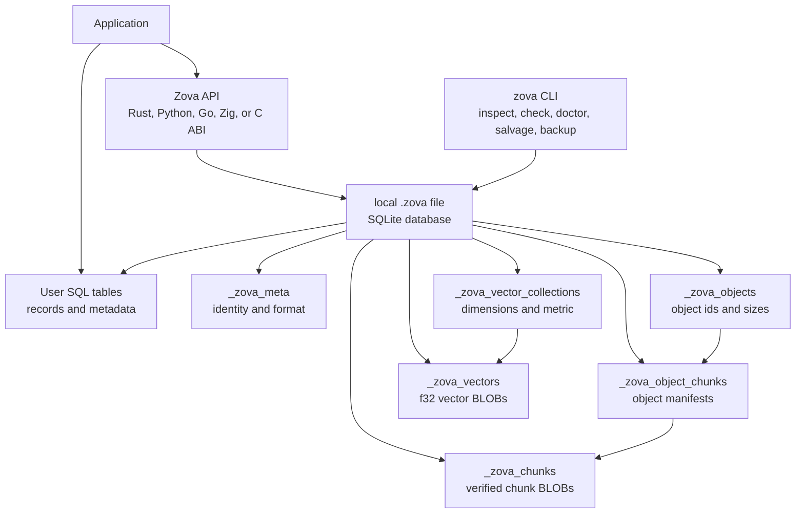

# Zova

SQLite-backed embedded database for records, objects, and vectors in one local
file.

Zova keeps SQLite as the relational core and adds native storage for
content-addressed objects, chunk manifests, streaming writes, exact vector
search, SQL-native vector queries, diagnostics, salvage, backup, compact copy,
and restore.

Current package version: `0.17.0`.

Zova is pre-1.0. The current `.zova` file `format_version` is `3`.

## Contents

1. [Install](#install)
2. [Dependency Matrix](#dependency-matrix)
3. [Quick Start](#quick-start)
4. [What Zova Stores](#what-zova-stores)
5. [Architecture](#architecture)
6. [Records](#records)
7. [Convert SQLite To Zova](#convert-sqlite-to-zova)
8. [Objects](#objects)
9. [Vectors](#vectors)
10. [SQL-Native Vector Search](#sql-native-vector-search)
11. [Operational Safety](#operational-safety)
12. [Diagnostics And Salvage](#diagnostics-and-salvage)
13. [CLI](#cli)
14. [Bindings](#bindings)
15. [Build From Source](#build-from-source)
16. [SQLite Policy](#sqlite-policy)
17. [Current Boundaries](#current-boundaries)
18. [Testing](#testing)
19. [Release Package Policy](#release-package-policy)
20. [License](#license)

## Install

Rust:

```sh
cargo add zova
```

or:

```toml
[dependencies]
zova = "0.17.0"
```

Python:

```sh
uv add zova
```

or:

```sh
python -m pip install zova
```

Go:

```sh
go get github.com/atasesli/zova/bindings/go@v0.17.0
```

The Go binding uses cgo over Zova's C ABI. Build or provide the C ABI library
before using it from another project.

C ABI:

```sh
zig build c-abi
```

CLI:

```sh
zig build
zig-out/bin/zova --help
```

## Dependency Matrix

Zova vendors SQLite. You do not need a system SQLite installation.

| Path | Main Command | Needs Zig | Needs Rust | Needs C Compiler | Notes |
|---|---|---:|---:|---:|---|
| Rust | `cargo add zova` | yes | yes | yes | `zova-sys` builds Zova's native C ABI from bundled source |
| Python | `uv add zova` / `pip install zova` | yes | yes | yes | source-first PyO3 build; no wheel matrix yet |
| Go | `go get github.com/atasesli/zova/bindings/go@v0.17.0` | yes, for C ABI build | no | yes, cgo | caller provides `zova.h` and `libzova_c.a` |
| C ABI | `zig build c-abi` | yes | no | yes | produces static `libzova_c.a` |
| Zig | package source | yes | no | yes | native API |
| CLI | `zig build` | yes | no | yes | source-built command line tool |

Minimum tool versions used by the project:

| Tool | Minimum / Current |
|---|---|
| Zig | `0.16.0` or newer |
| Rust | `1.79` or newer |
| Go | `1.22` or newer |
| Python | `3.10` or newer |
| SQLite | vendored `3.53.2` |

## Quick Start

### Rust

```rust
use zova::{Database, Step};

fn main() -> Result<(), zova::Error> {
    let mut db = Database::create("app.zova")?;
    db.exec("create table notes(id integer primary key, body text not null)")?;

    let mut insert = db.prepare("insert into notes(body) values (?1)")?;
    insert.bind_text(1, "hello from Rust")?;
    assert_eq!(insert.step()?, Step::Done);

    let object_id = db.put_object(b"large bytes live here")?;

    db.create_vector_collection(
        "chunks",
        zova::VectorCollectionOptions {
            dimensions: 2,
            metric: zova::VectorMetric::L2,
        },
    )?;
    db.put_vector("chunks", "chunk:1", &[0.0, 1.0])?;

    println!("stored object: {object_id:?}");
    Ok(())
}
```

### Python

```python
import zova

with zova.Database.create("app.zova") as db:
    db.exec("create table notes(id integer primary key, body text not null)")

    with db.prepare("insert into notes(body) values (?1)") as stmt:
        stmt.bind_text(1, "hello from Python")
        assert stmt.step() == zova.Step.DONE

    object_id = db.put_object(b"large bytes live here")

    db.create_vector_collection(
        "chunks",
        zova.VectorCollectionOptions(2, zova.VectorMetric.L2),
    )
    db.put_vector("chunks", "chunk:1", [0.0, 1.0])
```

### Go

```go
package main

import zova "github.com/atasesli/zova/bindings/go"

func main() {
    db, err := zova.Create("app.zova")
    if err != nil {
        panic(err)
    }
    defer db.Close()

    if err := db.Exec("create table notes(id integer primary key, body text not null)"); err != nil {
        panic(err)
    }
}
```

## What Zova Stores

Zova has three first-class storage shapes:

- **Records:** normal SQLite tables, indexes, views, triggers, and SQL.
- **Objects:** content-addressed bytes, chunked with FastCDC-v1 and addressed by
  `SHA-256(full bytes)`.
- **Vectors:** named vector collections with exact flat search and SQL-native
  query helpers.

Applications own their metadata in normal SQL tables. Zova-owned private tables
store object bytes, manifests, chunk rows, vector collections, and vector rows.
User tables should reference Zova object ids or vector ids.

```text
SQL row
  title       = "receipt.pdf"
  object_id   = <32-byte ObjectId>
  vector_id   = "receipt:chunk:42"
```

## Architecture



The file boundary is explicit:

```text
*.zova  -> Zova database
other   -> normal SQLite database
```

Renaming `app.db` to `app.zova` is not enough. A valid Zova database has Zova
metadata and private schema.

## Records

Records are just SQLite.

Use normal SQL for application tables:

```sql
create table attachments(
  id integer primary key,
  filename text not null,
  object_id blob not null,
  vector_id text
);
```

The C ABI and all bindings expose prepared statements, bind/step/column access,
transactions, savepoints, `last_insert_rowid`, `changes`, `total_changes`, and
column names. Serious application metadata belongs here.

## Convert SQLite To Zova

Existing SQLite databases can be copied into a new `.zova` file without
mutating the source database.

Use this when an application already has normal SQLite tables and wants to add
Zova objects, vectors, diagnostics, backup, compact copy, and salvage around
the same local file model.

Conversion is exposed through the native APIs:

```zig
try zova.convertSqliteToZova("app.sqlite", "app.zova");
```

```rust
zova::Database::convert_sqlite_to_zova("app.sqlite", "app.zova")?;
```

```go
err := zova.ConvertSqliteToZova("app.sqlite", "app.zova")
```

```python
zova.convert_sqlite_to_zova("app.sqlite", "app.zova")
```

The destination must be a new `.zova` path. If the SQLite source uses table
names reserved by Zova, conversion fails instead of silently rewriting the
application schema.

## Objects

Objects are raw bytes stored by content identity:

```text
ObjectId = SHA-256(full object bytes)
```

Zova splits objects into FastCDC-v1 chunks and deduplicates chunks inside the
same `.zova` file. You can put/get whole objects, range-read object bytes,
inspect manifests, fetch verified chunks, store loose chunks, and assemble a
complete object from chunks.

Use `ObjectWriter` when bytes arrive over time:

```rust
let mut writer = db.object_writer()?;
writer.write(b"chunk one")?;
writer.write(b"chunk two")?;
let object_id = writer.finish()?;
```

Deleting an object removes Zova-owned object rows and unreferenced chunks. It
does not scan or mutate user SQL rows. SQLite may reuse freed pages without
shrinking the file; use explicit vacuum or compact copy when you want file-size
reclamation.

## Vectors

Vectors live in named collections:

```text
collection: "chunks"
dimensions: 384
metric: cosine | l2 | dot
vector id: application-provided text
```

Supported metrics:

- cosine distance: `1 - cosine_similarity`
- L2 distance: Euclidean distance
- dot distance: `-dot_product`

Zova supports collection create/info/list/delete, vector CRUD, batch upsert,
exact search, candidate-filtered search, search-by-id, and inclusive distance
thresholds.

Search is exact and flat-scan in `0.17.0`. It is good for local datasets,
offline ranking, deterministic tests, and SQL-filter-first workflows. It is not
yet an ANN engine for million-scale low-latency search.

## SQL-Native Vector Search

Zova registers SQL vector helpers on `zova.Database` connections:

```sql
zova_vector_distance(collection, vector_id, query_vector_blob)
zova_vector_distance_by_id(collection, vector_id, source_vector_id)
```

It also exposes a read-only virtual table:

```sql
select
  c.id,
  c.text,
  s.distance
from zova_vector_search as s
join chunks as c on c.vector_id = s.vector_id
where s.collection = 'chunks'
  and s.query_vector = ?1
  and s.top_k = 10
order by s.rank;
```

`query_vector_blob` is little-endian `f32` data. This lets applications combine
SQL metadata filters with vector ranking without pulling the whole metadata set
into application code.

## Operational Safety

Zova includes file-level safety operations:

```sh
zova backup app.zova app.backup.zova
zova compact app.zova app.compact.zova
zova restore app.backup.zova app.restored.zova
```

- `backup` uses SQLite's online backup API.
- `compact` uses SQLite `VACUUM INTO` to create a space-reclaiming copy.
- `restore` copies a backup into a new destination file.

Destinations must be new `.zova` paths. Zova does not overwrite destination
files in these operations.

Savepoints are available for connection-local partial rollback:

```text
SAVEPOINT name
ROLLBACK TO name
RELEASE name
```

Bindings also expose scoped savepoint helpers for cleanup ergonomics.

## Diagnostics And Salvage

Zova keeps diagnostics non-mutating by default:

```sh
zova check app.zova
zova check --deep app.zova
zova doctor app.zova
zova salvage --dry-run app.zova
```

`doctor` explains file health and suggests next actions. `salvage --dry-run`
reports what appears recoverable. Real salvage writes readable, validated data
into a new file:

```sh
zova salvage damaged.zova recovered.zova
```

Salvage never mutates the source file and never overwrites the destination. A
good backup is still preferred when one exists.

## CLI

The CLI is for inspection, diagnostics, and operational workflows:

```sh
zova info app.zova
zova stats --json app.zova
zova objects app.zova
zova object app.zova <object-id-hex>
zova chunks app.zova
zova chunk app.zova <chunk-id-hex>
zova vectors app.zova
zova vector-collection app.zova chunks
zova tables app.zova
zova check --deep app.zova
zova doctor --json app.zova
```

JSON output includes `cli_json_version = 1`. CLI output is bounded and avoids
printing object bytes, chunk bytes, vector values, private schema SQL, and user
row values.

## Bindings

### Rust

Rust users normally use the safe crate:

```toml
[dependencies]
zova = "0.17.0"
```

The lower-level raw FFI crate is available as:

```toml
[dependencies]
zova-sys = "0.17.0"
```

`zova` exposes `Database` for single-owner code and `SharedDatabase` for an
opt-in cloneable `Send + Sync` handle. One shared handle is safe and internally
serialized; open multiple handles for true SQLite concurrency.

### Python

Install from PyPI:

```sh
uv add zova
```

The Python package is a PyO3/maturin extension backed by the Rust `zova` crate.
It exposes records, prepared statements, transactions, savepoints, backup,
compact, restore, objects, `ObjectWriter`, vectors, and SQL-native vector
search.

The package is source-first in `0.17.0`. Installs may build the native extension
locally and require Rust, Zig, and a C compiler. No official wheel matrix is
promised yet.

### Go

Install:

```sh
go get github.com/atasesli/zova/bindings/go@v0.17.0
```

Import:

```go
import zova "github.com/atasesli/zova/bindings/go"
```

The Go package uses cgo over `include/zova.h` and links `libzova_c.a`. Build the
C ABI first in this repository:

```sh
zig build c-abi
```

External Go projects should point cgo at an installed Zova C ABI:

```sh
CGO_CFLAGS="-I/path/to/zova/include" \
CGO_LDFLAGS="-L/path/to/zova/lib -lzova_c" \
go test ./...
```

### C ABI

The C ABI is the language-neutral integration layer:

```c
#include "zova.h"
```

It uses opaque handles, request structs, fixed-width ids, explicit free
functions, and `zova_status` return codes. Returned buffers, messages,
manifests, vectors, collection lists, and search results are owned by Zova and
must be freed with the matching `zova_*_free` function.

One `zova_database *` handle is internally serialized. Calls on the same handle
run one at a time. Multiple handles are the path for true concurrency and follow
normal SQLite locking behavior.

### Zig

Zig users can import the package and use the native facade:

```zig
const zova = @import("zova");

var db = try zova.Database.create("app.zova");
defer db.deinit();
```

The thin SQLite wrapper is also public as `zova.sqlite`.

## Build From Source

Build the CLI:

```sh
zig build
```

Run it:

```sh
zig build run
```

Build the C ABI:

```sh
zig build c-abi
```

Run the C ABI smoke tests:

```sh
zig build c-abi-test
```

Run Rust checks:

```sh
cargo test --workspace --manifest-path bindings/rust/Cargo.toml
```

Run Go checks after building the C ABI:

```sh
zig build c-abi
cd bindings/go
go test ./...
```

Run Python checks:

```sh
uv run --isolated --with maturin --with pytest --directory bindings/python maturin develop
uv run --isolated --with pytest --directory bindings/python python -m pytest
```

## SQLite Policy

Zova does not hide SQLite. SQL remains SQLite SQL, locking remains SQLite
locking, and PRAGMAs remain application policy.

Zova does not silently enable `PRAGMA foreign_keys = ON`, does not run `VACUUM`
automatically, does not enable `auto_vacuum`, and does not change journal or
synchronous settings automatically.

## Current Boundaries

Zova `0.17.0` does not include:

- ANN indexes such as HNSW or IVFFlat
- vector SQL operators
- object or chunk virtual tables
- embedding generation
- TypeScript or Swift bindings
- automatic Go module publishing
- a Python wheel matrix
- background worker threads hidden inside Zova
- in-place repair
- overwrite mode for backup/compact/restore/salvage
- remote sync, S3 compatibility, NATS integration, or Redis-like behavior
- compiled release artifacts

Diagnostics and salvage are CLI-first in this release. Bindings should not parse
human text output as a stable library contract.

## Testing

Run the core tests:

```sh
zig build test
zig build e2e
zig build cli-test
zig build c-abi-test
```

Run the full release smoke:

```sh
scripts/check-release.sh
```

## Release Package Policy

Zova releases source packages. The source archive includes:

- `README.md`
- `LICENSE`
- `build.zig`
- `build.zig.zon`
- `bindings/rust`
- `bindings/go`
- `bindings/python`
- `include`
- `src`
- `tests`
- `vendor`

Compiled CLI binaries, compiled C ABI libraries, Rust `target` directories, Go
build outputs, Python wheels, Python native extensions, and cache directories
are not release artifacts.

Release command:

```sh
scripts/package-release.sh 0.17.0
```

Do not run it until the exact commit is ready to tag and publish.

## License

Zova is MIT licensed. See `LICENSE`.

SQLite is vendored in `vendor/sqlite3.53.2` and is public domain.
