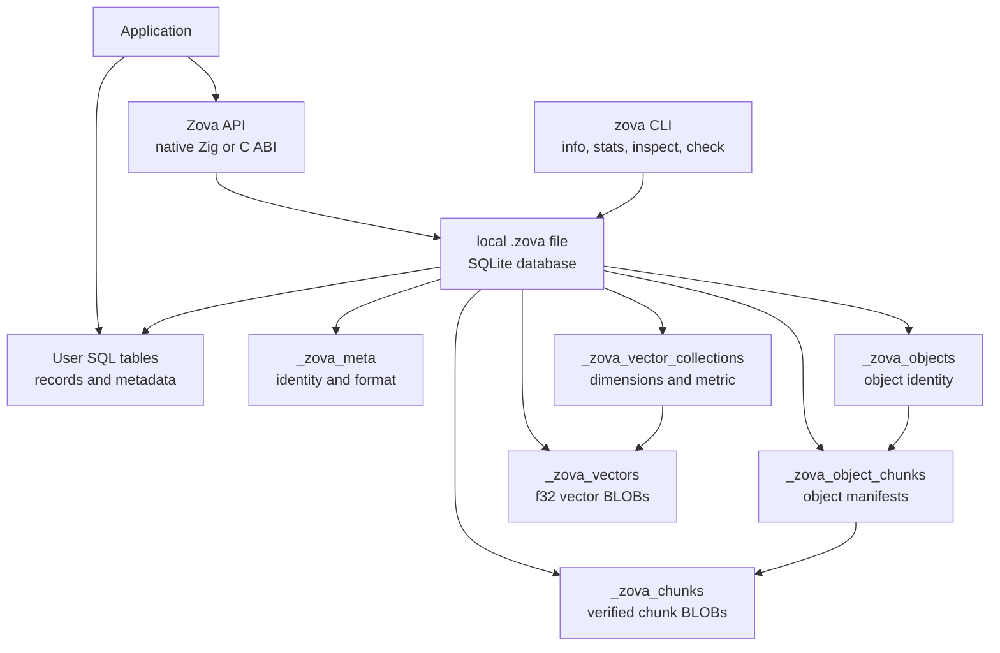

# Zova

SQLite-backed embedded database for records, objects, and vectors in one local
file.

Zova keeps SQLite as the relational core, then adds native local storage for
content-addressed objects, chunk manifests, streaming writes, and exact vector
search. Applications keep their own metadata in normal SQL tables and store
Zova object ids or vector ids alongside their rows.

Current package version: `0.13.0`.

Zova is not tied to one application language. The project exposes:

- a native Zig API
- a C ABI in `include/zova.h`
- source-first Rust bindings in `bindings/rust`
- a non-mutating CLI for inspection and checks
- a source-only release package that consumers build locally

Go, Python, TypeScript, and Swift bindings are planned as later layers over the
C ABI and Rust binding foundation.

## Architecture



## What Works In v0.13.0

- normal SQLite access through a thin wrapper
- `.zova` database create/open/validation
- conversion from an existing SQLite database into a new `.zova` file
- content-addressed objects with `ObjectId = SHA-256(full bytes)`
- FastCDC-v1 chunking and chunk deduplication
- object manifests and verified chunk reads
- range reads for previews and partial serving
- streaming object writes with `ObjectWriter`
- verified loose chunk ingest and object assembly from chunks
- native vector collections
- vector CRUD, batch upsert, collection info/list/delete
- exact vector search, candidate-filtered search, search-by-id, and thresholds
- SQL-native vector distance functions and the read-only `zova_vector_search`
  virtual table
- C ABI for database, prepared SQL statements, explicit maintenance, objects,
  chunks, writers, and vectors
- Rust bindings for records, prepared statements, transactions, vacuum, objects,
  chunks, manifests, `ObjectWriter`, vectors, and SQL-native vector search
- CLI `info`, `stats`, object/chunk/vector/table inspection, and `check`
- source-only release packaging

The `.zova` format is still pre-1.0. Current files use
`_zova_meta.format_version = '3'`. Opening a file validates the current private
schema and does not repair, migrate, or lazily initialize older experimental
files.

## File Boundary

Zova is opt-in at the file level:

```text
*.zova  -> Zova database
other   -> normal SQLite database
```

Renaming `app.db` to `app.zova` is not enough. A valid Zova database has Zova
metadata and the required private object/vector schema.

Normal SQLite files remain normal SQLite files. Existing BLOB columns are not
automatically converted into Zova objects or vectors.

## C ABI

The C ABI is the language-neutral integration point.

Files and build steps:

- `include/zova.h`
- `src/c_api.zig`
- `zig build c-abi`
- `zig build c-abi-test`

The ABI exposes:

- database create/open/close
- SQL `exec`
- prepared statements with bind/step/column/finalize
- explicit transaction helpers
- explicit `VACUUM`
- SQLite-to-Zova conversion
- object put/get/delete/existence/size/chunk count
- range reads
- object manifests and chunk reads
- verified loose chunk ingest
- object assembly from verified chunks
- streaming object writes
- vector collection create/exists/info/list/delete
- vector put/get/exists/delete
- batch vector put
- exact vector search, candidate-filtered search, search-by-id, and thresholds

Inputs are borrowed for the duration of each call. Paths and SQL use
null-terminated C strings. Bytes use pointer plus length. Vector values use
`const float *values` plus `size_t values_len`.

Returned buffers, messages, manifests, vectors, collection info, collection
lists, and search results are owned by Zova and must be freed explicitly:

```c
zova_buffer_free(&buffer);
zova_message_free(&message);
zova_text_free(&text);
zova_object_manifest_free(&manifest);
zova_vector_free(&vector);
zova_vector_collection_info_free(&info);
zova_vector_collection_list_free(&list);
zova_vector_search_results_free(&results);
```

Prepared SQL uses one Zova database handle. This is the intended path for
Rust, Go, and other bindings that want records, objects, and vectors through a
single database API instead of opening a second SQLite handle:

```c
zova_statement *stmt = NULL;
zova_database_prepare(&(zova_database_prepare_request){
    .db = db,
    .sql = "insert into attachments (object_id, filename) values (?, ?)",
    .out_statement = &stmt,
});

zova_statement_bind_blob(&(zova_statement_bind_blob_request){
    .statement = stmt,
    .index = 1,
    .data = object_id.bytes,
    .len = sizeof(object_id.bytes),
});

zova_statement_bind_text(&(zova_statement_bind_text_request){
    .statement = stmt,
    .index = 2,
    .data = (const uint8_t *)"photo.jpg",
    .len = strlen("photo.jpg"),
});

zova_step_result step = ZOVA_STEP_DONE;
zova_statement_step(&(zova_statement_step_request){
    .statement = stmt,
    .out_result = &step,
});
zova_statement_finalize(stmt);
```

Parameter indexes are 1-based, matching SQLite. Column indexes are 0-based.
Column text and blob outputs are owned copies; free them with `zova_text_free`
and `zova_buffer_free`.

Every C ABI function returns `zova_status`. `ZOVA_OK` means success.
`zova_status_name(status)` returns a static status name.

Database-scoped diagnostics:

```c
const char *message = zova_database_last_error_message(db);
```

The returned pointer is borrowed and valid until the next call on that database
handle or until close. Create/open/convert failures can also return an owned
`zova_message` through their request structs.

Handles are opaque. Do not use the same database or writer handle concurrently
from multiple threads. Multiple database handles to the same file are allowed
and follow SQLite locking.

The ABI is additive and pre-1.0.

## Rust Bindings

v0.13.0 adds source-first Rust bindings under `bindings/rust`.

The workspace contains:

- `zova-sys`, a small raw FFI crate over `include/zova.h`
- `zova`, a safe Rust wrapper for records, objects, and vectors

By default, `zova-sys` builds the local static C ABI with:

```sh
zig build c-abi
```

The safe `zova` crate exposes:

- `Database` lifecycle, conversion, `exec`, prepared statements, transactions,
  and explicit `vacuum`
- SQL records through one Zova handle, without opening a separate SQLite handle
- object APIs, chunk/manifests APIs, receive-side assembly, range reads, and
  `ObjectWriter`
- vector collections, CRUD, batch writes, exact search, candidate-filtered
  search, search-by-id, thresholds, and collection management
- SQL-native vector search through prepared statements, including
  `zova_vector_distance`, `zova_vector_distance_by_id`, and
  `zova_vector_search`

Run the Rust tests:

```sh
cargo test --workspace --manifest-path bindings/rust/Cargo.toml
```

The Rust crates are included in the source archive, but v0.13.0 does not publish
them to crates.io automatically and does not ship compiled libraries. Consumers
build from source.

## Native Zig API

Zig users can import the package directly:

```zig
const zova = @import("zova");
```

Use `zova.Database` for `.zova` files:

```zig
var db = try zova.Database.create("app.zova");
defer db.deinit();
```

Use `zova.sqlite.Database` when you only want the thin SQLite wrapper:

```zig
var db = try zova.sqlite.Database.open("app.db");
defer db.deinit();

try db.exec("create table notes (id integer primary key, body text not null)");
```

Raw SQLite access remains available through `zova.sqlite.c` and public handles:

```zig
const c = zova.sqlite.c;
_ = c.sqlite3_total_changes64(db.handle);
```

## Convert SQLite To Zova

Convert an existing SQLite database into a new `.zova` file:

```zig
try zova.convertSqliteToZova("app.db", "app.zova");
```

Conversion uses SQLite's backup API. It never mutates the source file and never
overwrites the destination. The destination must end in `.zova`.

Schemas that already use `_zova_*` names are rejected with
`error.ZovaNameConflict`, because those names are reserved for Zova internals.

## SQL Records

SQL remains SQLite SQL. User tables stay application-owned:

```zig
try db.exec(
    \\create table attachments (
    \\  id integer primary key,
    \\  object_id blob not null,
    \\  filename text not null,
    \\  mime_type text not null
    \\)
);
```

Zova does not scan or mutate your user tables when objects or vectors are
deleted. If a user table still references a deleted object id or vector id, that
reference is application state.

## Objects

Zova objects are raw content-addressed bytes:

```text
Object -> FastCDC-v1 chunks -> SQLite BLOB chunk rows
```

An `ObjectId` is the raw `[32]u8` SHA-256 digest of the full object bytes. The
same bytes produce the same id.

Store and read a complete object:

```zig
const id = try db.putObject("hello object");

var object = try db.getObject(allocator, id);
defer object.deinit(allocator);
```

Read part of an object without allocating the full object:

```zig
var preview: [16]u8 = undefined;
const copied = try db.readObjectRange(id, 0, &preview);
```

Delete object storage:

```zig
try db.deleteObject(id);
```

Deletion removes Zova-owned object rows, manifest rows, and unreferenced chunks.
It never scans or mutates user SQL rows.

Deletion frees logical storage inside SQLite. The `.zova` file may not shrink
immediately, because SQLite can keep freed pages for reuse. Run an explicit
vacuum when your application deliberately wants SQLite to rebuild the file:

```zig
try db.vacuum();
```

Through the C ABI:

```c
zova_database_vacuum(&(zova_database_simple_request){ .db = db });
```

Zova never runs `VACUUM` automatically and does not enable SQLite
`auto_vacuum` for you.

## Manifests, Chunks, And Transfers

Objects expose manifests so applications can inspect or transfer verified
chunks:

```zig
var manifest = try db.objectManifest(allocator, id);
defer manifest.deinit(allocator);

for (manifest.chunks) |chunk| {
    var data = try db.getObjectChunk(allocator, chunk.hash);
    defer data.deinit(allocator);
}
```

Loose chunks can be stored before they belong to a complete object:

```zig
const hash = zova.objectChunkId(received_bytes);
try db.putObjectChunk(hash, received_bytes);
```

`putObjectChunk` verifies that the supplied bytes match the expected SHA-256
chunk hash. Empty chunks and chunks larger than the current FastCDC maximum are
rejected.

Assemble a complete object from already stored chunks:

```zig
try db.assembleObjectFromChunks(object_id, size_bytes, manifest_chunks);
```

Transfer state belongs in user SQL tables: pending chunks, peer state, retries,
filenames, MIME types, UI progress, and final object references.

## Streaming Object Writes

Use `putObject` when the full byte slice is already in memory. Use
`ObjectWriter` when bytes arrive over time:

```zig
var writer = try db.objectWriter(allocator);
defer writer.deinit();

try writer.write(first_part);
try writer.write(second_part);

const id = try writer.finish();
```

The writer uses the same FastCDC-v1 boundaries as `putObject`, stores verified
chunks as they are emitted, and finishes by assembling the object from those
chunks. `cancel` removes unreferenced chunks seen by that writer. `deinit`
automatically cancels unfinished writers.

## Vectors

Zova vectors follow a pgvector-style model:

```text
SQL filters metadata
Zova ranks vector ids by distance
application joins ids back to SQL rows
```

Create a collection:

```zig
try db.createVectorCollection("chunks", .{
    .dimensions = 3,
    .metric = .cosine,
});
```

Supported metrics:

- `.cosine` with distance `1 - cosine_similarity`
- `.l2` with Euclidean distance
- `.dot` with distance `-dot_product`

Vectors are stored as deterministic little-endian `f32` BLOBs in private Zova
tables. Collection names and vector ids are UTF-8 text. Vector ids are scoped to
their collection and are application-provided.

Put vectors:

```zig
try db.putVector("chunks", "chunk-001", &.{ 0.1, 0.2, 0.3 });

try db.putVectors("chunks", &.{
    .{ .id = "chunk-001", .values = &.{ 0.1, 0.2, 0.3 } },
    .{ .id = "chunk-002", .values = &.{ 0.2, 0.3, 0.4 } },
});
```

Inspect and delete collections:

```zig
var info = try db.vectorCollectionInfo(allocator, "chunks");
defer info.deinit(allocator);

var collections = try db.listVectorCollections(allocator);
defer collections.deinit(allocator);

try db.deleteVectorCollection("chunks");
```

Collection deletion removes private vector rows and the collection row. It does
not scan or mutate user SQL tables.

## Vector Search

Collection-wide exact search:

```zig
var results = try db.searchVectors(
    allocator,
    "chunks",
    &.{ 0.1, 0.2, 0.3 },
    10,
);
defer results.deinit(allocator);
```

Candidate-filtered exact search:

```zig
const candidates = [_][]const u8{ "chunk-001", "chunk-004", "chunk-009" };

var filtered = try db.searchVectorsIn(
    allocator,
    "chunks",
    &.{ 0.1, 0.2, 0.3 },
    &candidates,
    5,
);
defer filtered.deinit(allocator);
```

Search by an existing vector id:

```zig
var neighbors = try db.searchVectorsById(
    allocator,
    "chunks",
    "chunk-001",
    10,
);
defer neighbors.deinit(allocator);
```

Threshold search is inclusive:

```zig
var close = try db.searchVectorsWithin(
    allocator,
    "chunks",
    &.{ 0.1, 0.2, 0.3 },
    0.25,
    10,
);
defer close.deinit(allocator);
```

Search is exact and flat-scan in v0.13.0. That is deliberate: Zova currently
prioritizes deterministic local correctness over approximate indexing. It is a
good fit for small and medium local datasets, offline ranking, tests that need
repeatable nearest-neighbor results, and candidate-filtered search where SQL
first narrows the metadata set and Zova ranks the eligible vector ids.

It is not yet a low-latency ANN engine for millions of vectors. Zova does not
include HNSW, IVFFlat, quantized indexes, or vector SQL operators in v0.13.0.

Missing candidate ids are skipped. Invalid candidate ids return
`error.VectorInvalid`. Corrupt selected vector rows return `error.VectorCorrupt`.

## SQL-Native Vector Search

v0.13.0 makes Zova vectors queryable from SQL on `zova.Database` connections.
The raw `zova.sqlite.Database` wrapper remains plain SQLite and does not
register Zova vector SQL helpers.

Registered scalar functions:

```sql
zova_vector_distance(collection, vector_id, query_vector_blob)
zova_vector_distance_by_id(collection, vector_id, source_vector_id)
```

`query_vector_blob` is a little-endian IEEE-754 `f32` blob with exactly the
collection dimension count. This is the same encoding Zova uses internally for
stored vectors.

In Zig, encode a query vector explicitly:

```zig
fn encodeVectorBlob(allocator: std.mem.Allocator, values: []const f32) ![]u8 {
    const bytes = try allocator.alloc(u8, values.len * @sizeOf(f32));
    errdefer allocator.free(bytes);

    for (values, 0..) |value, index| {
        std.mem.writeInt(u32, bytes[index * 4 ..][0..4], @bitCast(value), .little);
    }

    return bytes;
}
```

SQL-filter-first ranking:

```sql
select
  c.id,
  c.body,
  zova_vector_distance('chunks', c.vector_id, ?1) as distance
from chunks as c
where c.document_id = 'doc-123'
order by distance
limit 10;
```

Row-to-row nearest-neighbor style ranking:

```sql
select
  c.id,
  c.body,
  zova_vector_distance_by_id('chunks', c.vector_id, 'chunk-001') as distance
from chunks as c
where c.vector_id != 'chunk-001'
order by distance
limit 10;
```

The read-only eponymous-only virtual table is:

```sql
create table zova_vector_search(
  rank integer,
  vector_id text,
  distance real,
  collection text hidden,
  query_vector blob hidden,
  source_vector_id text hidden,
  top_k integer hidden,
  max_distance real hidden
);
```

Example:

```sql
select
  c.id,
  c.body,
  s.distance
from zova_vector_search as s
join chunks as c on c.vector_id = s.vector_id
where s.collection = 'chunks'
  and s.query_vector = ?1
  and s.top_k = 10
order by s.rank;
```

`zova_vector_search` requires `collection`, exactly one query source
(`query_vector` or `source_vector_id`), and at least one bound (`top_k` or
`max_distance`). `max_distance` is inclusive and may be negative for dot
distance collections. `top_k = 0` returns no rows after validating inputs.

The SQL integration is read-only. It does not expose object internals, mutate
user tables, create indexes, or run approximate search.

## CLI

The `zova` executable is a non-mutating inspection/check tool.

Build and run:

```sh
zig build
zig-out/bin/zova --help
```

Commands:

```sh
zova --version
zova --help
zova info [--json] <file.zova>
zova stats [--json] [--limit <n>] <file.zova>
zova objects [--json] [--limit <n>] <file.zova>
zova object [--json] [--limit <n>] <file.zova> <object-id>
zova chunks [--json] [--limit <n>] <file.zova>
zova chunk [--json] [--limit <n>] <file.zova> <chunk-id>
zova vectors [--json] [--limit <n>] <file.zova>
zova vector-collection [--json] [--limit <n>] <file.zova> <name>
zova tables [--json] [--limit <n>] <file.zova>
zova check [--json] [--deep] <file.zova>
```

`info` reports package/SQLite/format versions, file sizes, SQLite page stats,
object counts, chunk counts, vector counts, and table counts.

`stats` adds bounded storage statistics: object size stats, chunk size stats,
deduped bytes saved, per-collection vector stats, top objects, and top chunks.

`objects`, `object`, `chunks`, and `chunk` inspect ids/counts/sizes only. They
do not read or print object bytes or chunk bytes.

`vectors` lists vector collections. `vector-collection` reports one collection
and bounded vector ids. They do not decode or print vector values.

`tables` reports bounded user/private table names. It does not print schema SQL
or row data.

`check` validates Zova identity/schema and runs SQLite `PRAGMA quick_check`.
`check --deep` also validates object manifests, referenced chunks, full object
hashes, loose chunks, and vector row shape/finite values. It reports bounded
issue examples where practical.

JSON output uses `cli_json_version = 1` and follows the same privacy rules as
text output.

Exit codes:

- `0`: success or healthy file
- `1`: unexpected internal error
- `2`: usage error
- `3`: open, path, Zova identity, or unsupported version error
- `4`: integrity or corruption check failure

The CLI does not repair, migrate, delete loose chunks, rebuild manifests, run
`VACUUM`, change PRAGMAs, or mutate `.zova` files.

## SQLite Policy

Zova does not hide SQLite. SQL remains SQLite SQL, locking remains SQLite
locking, and PRAGMAs remain application policy.

Foreign-key enforcement is connection-local in SQLite. Zova private tables may
declare foreign keys for schema clarity, but Zova does not silently run
`PRAGMA foreign_keys = ON` because that would also affect user tables. Zova
validates object/vector integrity through its APIs and `zova check --deep`.

Similarly, Zova does not run `VACUUM`, enable `auto_vacuum`, or change journal
or synchronous settings automatically. Use explicit SQL or `Database.vacuum()`
when your application wants maintenance behavior.

## Vendored SQLite

Zova builds against the vendored SQLite amalgamation in `vendor/sqlite3.53.2`.

The build enables:

- `SQLITE_THREADSAFE=1`
- `SQLITE_ENABLE_FTS5`

Modern SQLite JSON support is built in for this SQLite version, so the old
`SQLITE_ENABLE_JSON1` flag is not required.

FTS5 and JSON are available as normal SQLite SQL. Zova does not add a separate
FTS or JSON API.

## Testing

Run unit/integration tests:

```sh
zig build test
```

Run file-backed end-to-end tests:

```sh
zig build e2e
```

Run CLI tests:

```sh
zig build cli-test
```

Build and test the C ABI:

```sh
zig build c-abi
zig build c-abi-test
```

Run Rust binding checks:

```sh
cargo fmt --all --manifest-path bindings/rust/Cargo.toml --check
cargo test --workspace --manifest-path bindings/rust/Cargo.toml
cargo check --examples --manifest-path bindings/rust/Cargo.toml
```

Run the full release smoke:

```sh
scripts/check-release.sh
```

## Release Package Policy

v0.13.0 releases a source-only package/archive. The package includes:

- `README.md`
- `build.zig`
- `build.zig.zon`
- `bindings/rust`
- `include`
- `src`
- `tests`
- `vendor`

The root `README.md` and `bindings/rust/README.md` are the only markdown files
included in the release package. Planning notes stay outside the package.

Compiled CLI binaries, compiled C ABI libraries, and compiled Rust artifacts are
not release artifacts. Consumers build the CLI, static C ABI library, and Rust
crates from source.

The release script:

```sh
scripts/package-release.sh 0.13.0
```

tags the current commit, pushes the branch and tag, creates a source archive,
and creates the GitHub release. Do not run it until the exact commit you want
to release is ready.

## Non-Goals In v0.13.0

Zova v0.13.0 does not include:

- ANN indexes
- HNSW or IVFFlat
- vector SQL operators
- object or chunk virtual tables
- embedding generation
- Go, Python, TypeScript, or Swift bindings
- crates.io publishing
- repair commands
- orphan scan CLI
- CLI mutation commands
- object or chunk extraction commands
- vector search commands in the CLI
- object compression or encryption
- remote sync
- daemon mode
- S3 compatibility
- Redis-like behavior
- NATS integration
- compiled release artifacts

## Design Philosophy

SQLite owns relational truth. Zova owns native local content that SQLite apps
usually bolt on by hand:

```text
records -> SQLite tables
objects -> content-addressed chunked bytes
vectors -> exact local similarity search
metadata -> user SQL tables
inspection -> non-mutating CLI
interop -> C ABI
```

The goal is not to hide SQLite. The goal is to keep records, objects, and
vectors together in one embedded local database without extra services.
