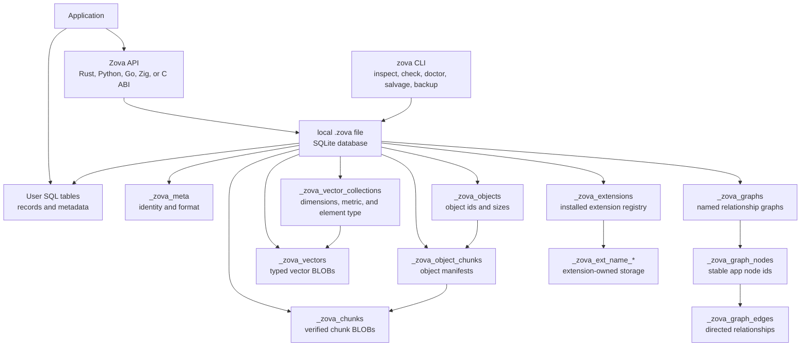

# Zova

SQLite-backed embedded database for records, objects, vectors, and graph-aware
relationships in local `.zova` files.

Zova keeps SQLite as the relational core and adds native storage for
content-addressed objects, chunk manifests, streaming writes, exact vector
search, SQL-native vector queries, graph relationships, SQL-native graph
traversal, transaction-aware app events, bound object/vector/graph stores,
diagnostics, salvage, backup, compact copy, restore, and a trusted extension
host foundation.

Current package version: `0.26.1`.

Zova is pre-1.0. The current `.zova` file `format_version` is `11`, and the
earliest migratable format is `9`. Open never migrates silently: format-9 and
format-10 databases are reported as migration-required and left byte-identical,
and downgrades are unsupported. Older databases migrate forward with the
explicit, copy-forward probe and migration surfaces (`zova format` and
`zova migrate` on the CLI, `zova_database_probe_format` and
`zova_database_migrate` on the C ABI, and aligned APIs in the Rust, Python, Go,
and JavaScript bindings). Migration writes only to a new, separately validated
format-11 destination and never mutates the source.

[Storage compatibility](docs/storage-compatibility.md) is the normative 1.x
contract. It distinguishes package version, C ABI version, SQLite version, and
Zova storage format, states which formats migrate forward, and documents the
migration workflow, offline locking, bound-store naming, temporary disk
requirements, interruption recovery, and extension compatibility.

Zova's bundled SQLite enables FTS5 and the read-only `dbstat` virtual table.
`dbstat` is available for storage diagnostics; it is not a portable guarantee
for databases opened through an unrelated system SQLite build.

Zova 0.26.1 is the native graph publication release. Format 9 stores graph
edge types through a private dictionary and keeps one opaque payload BLOB on
each authoritative edge without duplicating payload bytes into adjacency
indexes. Additive C APIs provide opaque-key graph mutation and reads,
payload-aware prepared graph builds, keyed payload reads and replacements, and
an atomic fresh-build session for predeclared table, FTS, graph, and vector
targets. The prepared graph path uses bounded bulk loading and defers index
construction until its ordered input is loaded. Existing graph APIs remain the
incremental and replay path, and public graph APIs continue to accept and
return edge-type strings.

## Contents

1. [Install](#install)
2. [Dependency Matrix](#dependency-matrix)
3. [Quick Start](#quick-start)
4. [What Zova Stores](#what-zova-stores)
5. [Architecture](#architecture)
6. [Records](#records)
7. [Convert SQLite To Zova](#convert-sqlite-to-zova)
8. [Objects](#objects)
9. [Vectors](#vectors)
10. [SQL-Native Vector Search](#sql-native-vector-search)
11. [Graphs](#graphs)
12. [SQL-Native Graph Traversal](#sql-native-graph-traversal)
13. [Operational Safety](#operational-safety)
14. [App Events](#app-events)
15. [Extensions](#extensions)
16. [Diagnostics And Salvage](#diagnostics-and-salvage)
17. [CLI](#cli)
18. [Bindings](#bindings)
19. [Build From Source](#build-from-source)
20. [Storage Compatibility](#storage-compatibility)
21. [SQLite Policy](#sqlite-policy)
22. [Current Boundaries](#current-boundaries)
23. [Testing](#testing)
24. [Release Package Policy](#release-package-policy)
25. [License](#license)

## Install

Rust:

```sh
cargo add zova
```

or:

```toml
[dependencies]
zova = "0.26.1"
```

Python:

```sh
uv add zova
```

or:

```sh
python -m pip install zova
```

Go:

```sh
go get github.com/ata-sesli/zova/bindings/go@v0.26.1
```

The Go binding uses cgo over Zova's C ABI. Build or provide the C ABI library
before using it from another project.

C ABI:

```sh
# Download a matching zova-v0.26.1-<platform>-c-abi archive
# from the GitHub Release, or build it locally:
zig build c-abi
```

CLI:

```sh
# Download a matching zova-v0.26.1-<platform>-cli archive
# from the GitHub Release, or build it locally:
zig build
zig-out/bin/zova --help
```

## Dependency Matrix

Zova vendors SQLite. You do not need a system SQLite installation.

| Path | Main Command | Needs Zig | Needs Rust | Needs C Compiler | Notes |
|---|---|---:|---:|---:|---|
| JavaScript / TypeScript | `bun add zova-js` / `npm install zova-js` | no | no | no | prebuilt Node-API 8 packages for Node 22/24 and Bun |
| Rust | `cargo add zova` | no | yes | yes | `zova-sys` builds Zova's native C ABI from bundled generated C |
| Python | `uv add zova` / `pip install zova` | no | only for sdist builds | only for sdist builds | wheels are published for Linux/macOS x86_64/arm64 on CPython 3.10/3.12; sdist fallback builds through Rust |
| Go | `go get github.com/ata-sesli/zova/bindings/go@v0.26.1` | no, if using a release C ABI archive | no | yes, cgo | caller provides `zova.h` and `libzova_c.a` |
| C ABI | release archive or `zig build c-abi` | no, if using a release archive | no | no, if using a release archive | static C ABI library and `zova.h` |
| Zig | package source | yes | no | yes | native API |
| CLI | release archive or `zig build` | no, if using a release archive | no | no, if using a release archive | source-built or prebuilt command line tool |

Minimum tool versions used by the project:

| Tool | Minimum / Current |
|---|---|
| Zig | `0.16.0` or newer |
| Rust | `1.79` or newer |
| Go | `1.22` or newer |
| Python | `3.10` or newer |
| Node.js | `22.13` or newer in the Node 22 line, or Node 24 |
| Bun | current blocking CI release |
| SQLite | vendored `3.53.4` |

## Quick Start

### JavaScript / TypeScript

```ts
import { Database } from "zova-js";

const db = Database.create("app.zova");
db.exec("create table notes(id integer primary key, body text not null)");
db.transaction((transaction) => {
  transaction.exec("insert into notes(body) values ('hello from TypeScript')");
});
db.close();
```

The npm package name is `zova-js`; the Zova product and native library names
remain unchanged.

### Rust

```rust
use zova::{Database, Step};

fn main() -> Result<(), zova::Error> {
    let mut db = Database::create("app.zova")?;
    db.exec("create table notes(id integer primary key, body text not null)")?;

    let mut insert = db.prepare("insert into notes(body) values (?1)")?;
    insert.bind_text(1, "hello from Rust")?;
    assert_eq!(insert.step()?, Step::Done);

    let object_id = db.put_object(b"large bytes live here")?;

    db.create_vector_collection(
        "chunks",
        zova::VectorCollectionOptions {
            dimensions: 2,
            metric: zova::VectorMetric::L2,
        },
    )?;
    db.put_vector("chunks", "chunk:1", &[0.0, 1.0])?;

    println!("stored object: {object_id:?}");
    Ok(())
}
```

### Python

```python
import zova

with zova.Database.create("app.zova") as db:
    db.exec("create table notes(id integer primary key, body text not null)")

    with db.prepare("insert into notes(body) values (?1)") as stmt:
        stmt.bind_text(1, "hello from Python")
        assert stmt.step() == zova.Step.DONE

    object_id = db.put_object(b"large bytes live here")

    db.create_vector_collection(
        "chunks",
        zova.VectorCollectionOptions(2, zova.VectorMetric.L2),
    )
    db.put_vector("chunks", "chunk:1", [0.0, 1.0])
```

### Go

```go
package main

import zova "github.com/ata-sesli/zova/bindings/go"

func main() {
    db, err := zova.Create("app.zova")
    if err != nil {
        panic(err)
    }
    defer db.Close()

    if err := db.Exec("create table notes(id integer primary key, body text not null)"); err != nil {
        panic(err)
    }
}
```

## What Zova Stores

Zova has four first-class storage shapes:

- **Records:** normal SQLite tables, indexes, views, triggers, and SQL.
- **Objects:** content-addressed bytes using either deduplicating FastCDC-v1
  chunks or fixed 1 MiB streaming chunks, addressed by `SHA-256(full bytes)`.
- **Vectors:** named vector collections with exact flat search and SQL-native
  query helpers.
- **Graphs:** named relationship graphs with application-provided stable node
  IDs and explicit directed edges.

Applications own their metadata in normal SQL tables. Zova-owned private tables
store object bytes, manifests, chunk rows, vector collections, and vector rows.
User tables should reference Zova object ids or vector ids.

```text
SQL row
  title       = "receipt.pdf"
  object_id   = <32-byte ObjectId>
  vector_id   = "receipt:chunk:42"
```

## Architecture


```mermaid
flowchart TD
    App["Application"]
    API["Zova API<br/>Rust, Python, Go, Zig, or C ABI"]
    CLI["zova CLI<br/>inspect, check, doctor, salvage, backup"]
    File["local .zova file<br/>SQLite database"]
    UserSQL["User SQL tables<br/>records and metadata"]
    Meta["_zova_meta<br/>identity and format"]
    Objects["_zova_objects<br/>object ids and sizes"]
    Chunks["_zova_chunks<br/>verified chunk BLOBs"]
    Manifest["_zova_object_chunks<br/>object manifests"]
    VecCols["_zova_vector_collections<br/>dimensions, metric, and element type"]
    Vecs["_zova_vectors<br/>typed vector BLOBs"]
    Graphs["_zova_graphs<br/>named relationship graphs"]
    Nodes["_zova_graph_nodes<br/>stable app node ids"]
    Edges["_zova_graph_edges<br/>directed relationships"]
    Ext["_zova_extensions<br/>installed extension registry"]
    ExtStore["_zova_ext_name_*<br/>extension-owned storage"]

    App --> API
    App --> UserSQL
    API --> File
    CLI --> File
    File --> UserSQL
    File --> Meta
    File --> Objects
    File --> Chunks
    File --> Manifest
    File --> VecCols
    File --> Vecs
    File --> Graphs
    File --> Ext
    Ext --> ExtStore
    Graphs --> Nodes
    Nodes --> Edges
    Objects --> Manifest
    Manifest --> Chunks
    VecCols --> Vecs
```

The file boundary is explicit:

```text
*.zova  -> Zova database
other   -> normal SQLite database
```

Renaming `app.db` to `app.zova` is not enough. A valid Zova database has Zova
metadata and private schema.

## Records

Records are just SQLite.

Use normal SQL for application tables:

```sql
create table attachments(
  id integer primary key,
  filename text not null,
  object_id blob not null,
  vector_id text
);
```

The C ABI and all bindings expose prepared statements, bind/step/column access,
transactions, savepoints, `last_insert_rowid`, `changes`, `total_changes`, and
column names. Serious application metadata belongs here.

## Convert SQLite To Zova

Existing SQLite databases can be copied into a new `.zova` file without
mutating the source database.

Use this when an application already has normal SQLite tables and wants to add
Zova objects, vectors, diagnostics, backup, compact copy, and salvage around
the same local file model.

Conversion is exposed through the native APIs:

```zig
try zova.convertSqliteToZova("app.sqlite", "app.zova");
```

```rust
zova::Database::convert_sqlite_to_zova("app.sqlite", "app.zova")?;
```

```go
err := zova.ConvertSqliteToZova("app.sqlite", "app.zova")
```

```python
zova.convert_sqlite_to_zova("app.sqlite", "app.zova")
```

The destination must be a new `.zova` path. If the SQLite source uses table
names reserved by Zova, conversion fails instead of silently rewriting the
application schema.

For a full application migration path, see
[SQLite App To Zova App Migration Guide](docs/sqlite-to-zova.md).

## Objects

Objects are raw bytes stored by content identity:

```text
ObjectId = SHA-256(full object bytes)
```

The default `deduplication` profile preserves FastCDC-v1 chunking. The additive
`streaming` profile stores exact 1 MiB chunks except for the final remainder,
which sharply reduces manifest rows for large low-deduplication payloads. Both
profiles keep the same full-object identity and verified chunk model. Existing
objects retain their first valid physical representation when replayed through
another profile.

You can put/get whole objects, range-read object bytes, inspect manifests,
fetch verified chunks, store loose chunks, assemble complete objects, or use a
sequential reader whose memory stays bounded independently of object size.

### Optional Bound Object, Vector, And Graph Stores

Single-file `.zova` remains the default. In v0.26.1, applications can opt into
one bound object store, one bound vector store, and one bound graph store when
large object bytes, vector rows, or graph topology should live beside the main
records database:

```sh
zova object-store create objects.zova
zova object-store bind main.zova objects.zova
zova object-store info main.zova

zova vector-store create vectors.zova
zova vector-store bind main.zova vectors.zova
zova vector-store info main.zova

zova graph-store create graphs.zova
zova graph-store bind main.zova graphs.zova
zova graph-store info main.zova
```

Use `bind` for new or empty Zova-owned storage. If the main file already has
object, vector, or graph rows that you want to move out, use `split` instead:

```sh
zova split --objects main.zova objects.zova
zova split --vectors main.zova vectors.zova
zova split --graphs main.zova graphs.zova
```

`split` is an in-place local migration. It creates a new store file, copies the
selected Zova-owned private rows into that store, clears those private rows from
the main file, binds the new store, and verifies the result. User SQL tables and
rows stay in `main.zova`. The destination store must be a new `.zova` path; Zova
does not overwrite existing files. Take a backup before splitting; after a
successful split, rollback means restoring that backup or running another
explicit local migration.

After binding, Zova attaches the object store to the main SQLite connection and
routes `_zova_objects`, `_zova_chunks`, and manifests through the internal
`object_store` schema. A bound vector store similarly routes vector collections
and vector rows through the internal `vector_store` schema. A bound graph store
routes graphs, nodes, and edges through the internal `graph_store` schema.
User SQL records stay in the main database. If a store file is moved, run
`bind` again with the new path:

```sh
zova object-store bind main.zova new/path/objects.zova
zova vector-store bind main.zova new/path/vectors.zova
zova graph-store bind main.zova new/path/graphs.zova
```

Use the matching `object-store unbind`, `vector-store unbind`, or
`graph-store unbind` command to remove binding metadata without deleting the
store file.

`bind` is a safe set-or-replace operation for already-empty or already-bound
storage: Zova validates the new store file before updating the main database's
binding metadata. It rejects a first-time bind when the main file already
contains object/vector/graph rows, because that would hide existing data. Use
`split` for that case. The main database records store identity, a bound-set id,
and object/vector/graph epochs. Normal open rejects missing stores, wrong stores,
marker mismatches, and split bound sets instead of silently continuing. `doctor` and
`check --deep` report those as `bound_store` diagnostics so the problem is
visible without mutating any file. For a moved store path, run `bind` again with
the new location; marker mismatches are treated as consistency problems, not
path-repair prompts.

`backup`, `compact`, and `restore` are bound-store-aware: they copy readable
bound object/vector/graph data back into the new destination so the produced
file is self-contained.

Object writes, deletes, chunk writes, assembly, and `ObjectWriter.finish` can
participate in the same Zova transaction/savepoint as main-file SQL when an
object store is bound. Vector collection and vector row mutations follow the
same transaction/savepoint stack when a vector store is bound. Graph mutations
likewise route transparently and advance the graph epoch once
per successful mutation or batch when a graph store is bound.
Store management is still explicit: `bind`, `unbind`, and replacement binds are
rejected while the main database has an active transaction or savepoint.

SQLite's `ATTACH` rules still matter. Multi-file transactions are crash-atomic
only under SQLite's documented journal-mode conditions. Zova does not claim a
stronger guarantee; the bound-set id and epoch exist so Zova can detect and
explain split-file states during open, `doctor`, and `check --deep`.

This is local, manual storage placement. It is not distributed storage, cloud
sync, automatic path repair, or a multi-file transaction guarantee. Zova
supports at most three optional stores total: one object store, one vector
store, and one graph store. Multiple named stores are deferred.

Use `ObjectWriter` when bytes arrive over time:

```rust
let mut writer = db.object_writer()?;
writer.write(b"chunk one")?;
writer.write(b"chunk two")?;
let object_id = writer.finish()?;
```

Deleting an object removes Zova-owned object rows and unreferenced chunks. It
does not scan or mutate user SQL rows. SQLite may reuse freed pages without
shrinking the file; use explicit vacuum or compact copy when you want file-size
reclamation.

## Vectors

Vectors live in named collections:

```text
collection: "chunks"
dimensions: 384
metric: cosine | l2 | dot
element type: f32 | f16 | i8
vector id: application-provided text
```

`f32` is the default and keeps the existing APIs/file behavior. Raw `f16`
collections store IEEE 754 binary16 bits as little-endian `uint16` values, and
raw `i8` collections store signed bytes. These are storage element types, not
automatic quantization; Zova does not add scales, zero-points, reranking, or ANN
indexes for them.

Supported metrics:

- cosine distance: `1 - cosine_similarity`
- L2 distance: Euclidean distance
- dot distance: `-dot_product`

Zova supports collection create/info/list/delete, vector CRUD, batch upsert,
exact search, candidate-filtered search, search-by-id, and inclusive distance
thresholds.

Search is exact and flat-scan in `0.26.1`. It is good for local datasets,
offline ranking, deterministic tests, and SQL-filter-first workflows. It is not
yet an ANN engine for million-scale low-latency search.

## SQL-Native Vector Search

Zova registers SQL vector helpers on `zova.Database` connections:

```sql
zova_vector_distance(collection, vector_id, query_vector_blob)
zova_vector_distance_by_id(collection, vector_id, source_vector_id)
```

It also exposes a read-only virtual table:

```sql
select
  c.id,
  c.text,
  s.distance
from zova_vector_search as s
join chunks as c on c.vector_id = s.vector_id
where s.collection = 'chunks'
  and s.query_vector = ?1
  and s.top_k = 10
order by s.rank;
```

For `f32` collections, `query_vector_blob` is little-endian `f32` data. Typed
collections use query blobs matching their collection element type; `f16` blobs
are little-endian `uint16` bit patterns and `i8` blobs are raw signed bytes.
This lets applications combine SQL metadata filters with vector ranking without
pulling the whole metadata set into application code.

## Graphs

Graphs let applications store relationships between records, objects, chunks,
vectors, entities, facts, concepts, and external references.

Zova does not invent row IDs for your app. Nodes use stable IDs that the
application provides:

```text
message:123 --has_attachment--> object:8f...
message:123 --embedded_as--> vector:chunks:message-123
entity:person:alice --mentioned_in--> message:123
fact:991 --supported_by--> chunk:doc7:12
```

Graph rows store topology and small routing fields only. Application metadata
stays in normal SQL tables. Zova validates graph names, node IDs, edge types,
edge endpoint existence, and Zova-owned targets such as object IDs, chunk IDs,
and vector IDs. It does not validate arbitrary user SQL row existence; apps own
that contract.

CLI inspection is bounded and privacy-aware:

```sh
zova graphs app.zova
zova graph app.zova app
zova graph-node app.zova app message:123
zova graph-neighbors --limit 20 app.zova app message:123
zova graph-walk --max-depth 2 --limit 50 app.zova app message:123
```

This is a local graph-aware relationship layer, not Neo4j, Cypher, GQL,
Gremlin, SPARQL, or automatic LLM extraction.

## SQL-Native Graph Traversal

Zova registers read-only graph virtual tables on Zova SQLite connections:

```sql
select m.body, g.edge_type
from zova_graph_neighbors as g
join messages as m on m.graph_node_id = g.node_id
where g.graph_name = 'default'
  and g.source_node_id = 'message:123'
  and g.direction = 'outgoing'
  and g."limit" = 20
order by g.rank;
```

For bounded directed walks:

```sql
select node_id, depth, predecessor_node_id, edge_type
from zova_graph_walk
where graph_name = 'default'
  and start_node_id = 'message:123'
  and edge_type_filter = 'mentions'
  and max_depth = 2
  and "limit" = 50
order by rank;
```

`zova_graph_neighbors` returns one-hop neighboring nodes. `zova_graph_walk`
returns the start node plus bounded reachable nodes. In both helpers, visible
`node_id` is the returned node ID; input nodes use `source_node_id` or
`start_node_id`. Apps join those node IDs back to their own SQL tables.

## Operational Safety

Zova includes file-level safety operations:

```sh
zova backup app.zova app.backup.zova
zova compact app.zova app.compact.zova
zova restore app.backup.zova app.restored.zova
```

- `backup` uses SQLite's online backup API.
- `compact` uses SQLite `VACUUM INTO` to create a space-reclaiming copy.
- `restore` copies a backup into a new destination file.

Destinations must be new `.zova` paths. Zova does not overwrite destination
files in these operations.

Savepoints are available for connection-local partial rollback:

```text
SAVEPOINT name
ROLLBACK TO name
RELEASE name
```

Bindings also expose scoped savepoint helpers for cleanup ergonomics.

## App Events

Zova has same-process `listen` / `notify` app events for storage workflows:

```rust
let mut listener = db.listen("message:1:attachments")?;
let object_id = db.put_object(b"attachment bytes")?;

db.begin_immediate()?;
// Store object_id in your SQL metadata row here.
db.notify("message:1:attachments", "changed")?;
assert!(listener.try_receive()?.is_none());
db.commit()?;

let event = listener.try_receive()?.unwrap();
assert_eq!(event.payload, "changed");
```

Notifications are explicit, local to one open database handle, in-memory, and
non-persistent. They are delivered to subscription queues after commit. Rollback
discards pending notifications. Savepoint rollback discards inner pending
notifications; savepoint release preserves them for the outer scope.
SQL `zova_notify(...)` participates in this model when transactions/savepoints
are opened through Zova helpers; raw SQL transaction scopes that Zova cannot
track are rejected instead of guessed.

In-memory databases support the full event model with no changes:

```python
with zova.Database.create_memory() as db:
    with db.listen("cache:search-results") as sub:
        db.begin_immediate()
        db.kv_put_many(b"search-results", [(b"result-1", b"one"), (b"result-2", b"two")])
        db.notify("cache:search-results", "generation:42")
        db.commit()
        assert sub.try_receive().payload == "generation:42"
```

This is useful when one process wants a clean storage-runtime boundary: a write
workflow stores records, objects, vectors, or graph relationships, then notifies
another part of the same process to reload by id. Graph mutations do not emit
automatic events; call `notify("graph:changed", "...")` explicitly inside the
same transaction when your app wants listeners to refresh graph-derived views.
KV mutation batches commit atomically with a caller-owned transaction, so a
single explicit `notify` next to the batch fires exactly once on commit — use it
as an aggregate cache-invalidation signal. It is not cross-process delivery,
replay, replication, audit logging, or automatic mutation tracking.

The JavaScript bindings expose events on both the synchronous and asynchronous
database wrappers:

```ts
const db = AsyncDatabase.create(path);
const sub = await db.listen("cache:search-results");
await db.notify("cache:search-results", "generation:42");
const note = await sub.tryReceiveAsync(); // { channel, payload, sequence, droppedBefore }
sub.close();
```

Queue details:

- channel names are ASCII, 1-128 bytes, using letters, digits, `_`, `.`, `:`,
  and `-`
- payloads are UTF-8 text, up to 64 KiB
- each subscription queue holds 1024 notifications
- when a queue overflows, Zova drops the oldest notification and reports the
  drop count on the next received notification
- the current event API has polling only: use `try_receive` / drain loops, not
  callbacks

### Benchmarks

The event implementation is benchmarked at the core level and through every
binding. All report median, median absolute deviation, and p95 over 100 samples
after 20 warmups, using the same six scenarios: transaction commit with no
notification (baseline), commit with one notification, multi-listener fan-out,
an aggregate notification after a 4096-entry atomic KV batch (paired with the
no-notification batch baseline), and queue receive overhead (256 prefilled
events, timing only the drain).

Core (`zig build bench-notifications`):

```
commit_no_notify                    median_ms=0.003578 mad_ms=0.000126 p95_ms=0.003773
commit_one_notify                   median_ms=0.008493 mad_ms=0.000762 p95_ms=0.011308
commit_one_notify_no_receive        median_ms=0.007241 mad_ms=0.000070 p95_ms=0.007488
commit_256_four_listeners           median_ms=1.927514 mad_ms=0.050987 p95_ms=3.007601
kv_batch_4096_commit_no_notify      median_ms=19.161459 mad_ms=0.754627 p95_ms=21.712915
kv_batch_4096_commit_one_notify     median_ms=16.633315 mad_ms=0.726236 p95_ms=23.738989
receive_256_prefilled               median_ms=0.309051 mad_ms=0.001663 p95_ms=0.375438
notify_256_overflow_drop_oldest     median_ms=1.658519 mad_ms=0.010386 p95_ms=2.300395
```

C ABI (`zig build bench-notifications-c`):

```
commit_no_notify                    median_ms=0.003564 mad_ms=0.000134 p95_ms=0.007056
commit_one_notify                   median_ms=0.006514 mad_ms=0.000023 p95_ms=0.006565
commit_256_four_listeners           median_ms=2.574601 mad_ms=0.090395 p95_ms=3.710081
kv_batch_4096_commit_no_notify      median_ms=18.166286 mad_ms=0.808803 p95_ms=22.187889
kv_batch_4096_commit_one_notify     median_ms=18.081479 mad_ms=1.015322 p95_ms=21.408133
receive_256_prefilled               median_ms=1.430252 mad_ms=0.012749 p95_ms=2.007642
```

Rust (`cargo run --release --example notifications_bench`):

```
commit_no_notify                    median_ms=0.001050 mad_ms=0.000002 p95_ms=0.001054
commit_one_notify                   median_ms=0.001691 mad_ms=0.000012 p95_ms=0.001726
commit_256_four_listeners           median_ms=0.754689 mad_ms=0.004277 p95_ms=1.468700
kv_batch_4096_commit_no_notify      median_ms=6.716830 mad_ms=0.363157 p95_ms=9.560357
kv_batch_4096_commit_one_notify     median_ms=6.627833 mad_ms=0.254954 p95_ms=8.764389
receive_256_prefilled               median_ms=0.146913 mad_ms=0.000780 p95_ms=0.321646
```

Python (`python bench/notifications.py` in `bindings/python`):

```
commit_no_notify                    median_ms=0.002861 mad_ms=0.000051 p95_ms=0.007184
commit_one_notify                   median_ms=0.009502 mad_ms=0.000057 p95_ms=0.009853
commit_256_four_listeners           median_ms=2.984105 mad_ms=0.096359 p95_ms=4.922503
kv_batch_4096_commit_no_notify      median_ms=10.310229 mad_ms=0.812025 p95_ms=13.662522
kv_batch_4096_commit_one_notify     median_ms=10.936225 mad_ms=1.053548 p95_ms=14.344746
receive_256_prefilled               median_ms=0.609753 mad_ms=0.006064 p95_ms=1.251470
```

Go (`go test -run '^$' -bench BenchmarkNotifications -benchtime=1x` in
`bindings/go`):

```
commit_no_notify                    median_ms=0.005000 mad_ms=0.000000 p95_ms=0.008000
commit_one_notify                   median_ms=0.008000 mad_ms=0.000000 p95_ms=0.008000
commit_256_four_listeners           median_ms=3.514000 mad_ms=0.122000 p95_ms=5.200000
kv_batch_4096_commit_no_notify      median_ms=19.196000 mad_ms=0.887000 p95_ms=22.505000
kv_batch_4096_commit_one_notify     median_ms=19.017000 mad_ms=0.836000 p95_ms=21.675000
receive_256_prefilled               median_ms=0.662000 mad_ms=0.024000 p95_ms=1.016000
```

JavaScript (`bun run bench:notifications`):

```
commit_no_notify                    median_ms=0.007860 mad_ms=0.000880 p95_ms=0.018424
commit_one_notify                   median_ms=0.021574 mad_ms=0.002513 p95_ms=0.041517
commit_256_four_listeners           median_ms=4.394772 mad_ms=0.640949 p95_ms=6.581401
kv_batch_4096_commit_no_notify      median_ms=17.775350 mad_ms=1.516011 p95_ms=24.756578
kv_batch_4096_commit_one_notify     median_ms=18.357205 mad_ms=1.396160 p95_ms=23.914743
receive_256_prefilled               median_ms=0.816664 mad_ms=0.037648 p95_ms=1.620231
```

The `kv_batch_4096_commit_*` pair is the aggregate-invalidation path: a 4096-entry
atomic KV batch with and without a single aggregate `notify` at commit; the
notification adds sub-millisecond overhead to the batch. The
`commit_no_notify` / `commit_one_notify` pair shows the marginal cost of one
notification per committed transaction. Numbers are a snapshot for one host;
they demonstrate the measurement harness and relative costs, not absolute
cross-language throughput.

## Extensions

The v0.23 release includes the extension host, controlled app-defined SQL
callbacks, trusted local extension bundles, and the first bundled extension,
`trgm`.

An extension is trusted process code plus private Zova metadata:

- the database records installed extension metadata in `_zova_extensions`
- an extension owns only tables with its `_zova_ext_<name>_` prefix
- extension code is provided by the process, not loaded from the `.zova` file
- SQL functions or virtual tables are registered on each opened Zova connection
- install, check, and drop hooks run inside Zova-managed transactions
- extension registry and private storage live in the main database in the
  current v0 model

This keeps `.zova` files non-executable. A file may say it requires an
extension, but the application or CLI process decides which extension code is
available and trusted. Opening a database with an installed required extension
whose code is unavailable fails clearly instead of silently ignoring the
extension.

The host foundation supports app-registered extensions in native Zig and CLI
inspection/management:

```sh
zova extension list app.zova
zova extension info app.zova <name>
zova extension check app.zova [name]
zova extension drop app.zova <name>
zova extension install app.zova <name>
```

It also supports explicitly trusted local `.zovaext` bundles for one process at
a time:

```sh
zova extension trust ./my_ext.zovaext
zova --extension ./my_ext.zovaext extension install app.zova my_ext
zova --extension ./my_ext.zovaext check --deep app.zova
zova extension trusted
zova extension untrust my_ext
```

Trusted bundles are native code. Zova records hashes of the bundle manifest and
library; if either changes, the bundle must be trusted again. Zova never loads
extension code just because a `.zova` file contains extension metadata.
If a command needs a dynamic extension that is missing or untrusted, diagnostics
tell you to provide `--extension <bundle.zovaext>` or trust the bundle first.

Dynamic `.zovaext` loading is a native Zig/CLI/C ABI capability. The generated-C
snapshot used by package builds intentionally disables dynamic loading because
Zig `0.16` does not portably emit the `std.DynLib` loader path through its C
backend. Those builds keep the C ABI bundle symbols for source compatibility,
but calls that need to load an external bundle fail with an extension load or
unavailable status. Use the native CLI or a Zig-built C ABI archive when an
application needs external `.zovaext` loading.

The v0.23 release also includes an experimental bundle producer CLI:

```sh
zova extension scaffold ./sample_ext --name sample_ext --version 0.1.0
zova extension build ./sample_ext
zova extension pack ./sample_ext --out ./sample_ext.zovaext
zova extension verify --smoke ./sample_ext.zovaext
```

At the low-level C ABI, apps can register scalar SQL functions on Zova-owned
connections with `zova_database_register_function`. Callback arguments are
borrowed for the call only, result bytes are copied by Zova, and callbacks must
not re-enter the same `zova_database` handle. Safe high-level Rust, Go, and
Python callback APIs are not part of the v0.25 release. See
`examples/c_callbacks/` for C callback snippets and `examples/zig_bridge/` for
a minimal native Zig registry bridge.

`install` succeeds only for extensions registered in the current process or
bundled with Zova. The default Zova process registry includes `trgm`, so this
works in the normal CLI build:

```sh
zova extension install app.zova trgm
```

After installation, Zova registers the `zova_trgm_*` SQL surface on each open
connection. `trgm` is for fuzzy target lookup: typo-tolerant matching over app
document IDs that point back to records, objects, chunks, vectors, graph nodes,
entities, facts, concepts, or external refs.

Those target refs may point at objects or vectors stored in optional bound
stores. The extension index itself still stays in the main database.

```sql
select zova_trgm_create_index('messages');
select zova_trgm_put(
  'messages',
  'message:123',
  'record',
  'messages',
  '123',
  'attachment upload failed'
);

select document_id, score
from zova_trgm_search
where index_name = 'messages'
  and query = 'attachement failed'
  and threshold = 0.20
  and "limit" = 10
order by rank;
```

`trgm` is not SQLite FTS and not vector search. FTS is best for tokenized
full-text search such as matching words and phrases. Vectors are best for
semantic similarity. Trigram lookup is useful when the query or target has
small spelling differences, filename variations, IDs, short labels, or
operator-entered text where typo tolerance matters.

Extension operations do not emit automatic app events. If an application wants
same-process listeners to react to indexing, it should call `notify` explicitly
inside the same transaction, for example `notify("search:indexed", "messages")`.

For the host contract, authoring shape, storage rules, diagnostics behavior,
and current non-goals, see [docs/extensions.md](docs/extensions.md).

When moving a database that requires extensions, move or document the required
extension code too. Bundled extensions such as `trgm` are available in the
normal Zova process. Dynamic local extensions must be trusted and supplied again
by the receiving CLI command or application process; `.zova` files never
auto-load them.

## Diagnostics And Salvage

Zova keeps diagnostics non-mutating by default:

```sh
zova check app.zova
zova check --deep app.zova
zova doctor app.zova
zova salvage --dry-run app.zova
```

`doctor` explains file health and suggests next actions. `salvage --dry-run`
reports what appears recoverable. Real salvage writes readable, validated data
into a new file:

```sh
zova salvage damaged.zova recovered.zova
```

Salvage never mutates the source file and never overwrites the destination. A
good backup is still preferred when one exists. In v0.26.1, salvage is
graph-aware and extension-aware: it copies valid graph topology, skips invalid
graph nodes or edges, and lets trusted extension hooks recover their own private
storage.

Diagnostics also include extension health. Unknown `_zova_ext_*` storage and
corrupt `trgm` private tables are
reported as extension issues without printing indexed text or private schema
SQL.

Extension-aware salvage is hook-based. Core Zova never copies `_zova_ext_*`
tables by guessing their meaning. If trusted extension code provides a salvage
hook, Zova lets that extension copy, rebuild, or skip its own storage. If the
extension code is unavailable or the extension has no salvage hook, extension
storage is skipped and reported. In v0.26.1, bundled `trgm` salvage recovers a
valid subset of trgm private storage, rebuilds derived term rows from copied
postings, and still never prints indexed text or private schema SQL.

## CLI

The CLI is for inspection, diagnostics, and operational workflows:

```sh
zova info app.zova
zova stats --json app.zova
zova objects app.zova
zova object app.zova <object-id-hex>
zova chunks app.zova
zova chunk app.zova <chunk-id-hex>
zova vectors app.zova
zova vector-collection app.zova chunks
zova graphs app.zova
zova graph app.zova app
zova graph-node app.zova app message:123
zova graph-neighbors --limit 20 app.zova app message:123
zova graph-walk --max-depth 2 --limit 50 app.zova app message:123
zova tables app.zova
zova check --deep app.zova
zova format --json app.zova
zova migrate --json old-9.zova new-10.zova
zova doctor --json app.zova
zova object-store info app.zova
zova vector-store info app.zova
zova graph-store info app.zova
zova split --graphs app.zova graphs.zova
zova extension list app.zova
zova extension check app.zova
```

JSON output includes `cli_json_version = 1`. CLI output is bounded and avoids
printing object bytes, chunk bytes, vector values, private schema SQL, and user
row values.

## Bindings

### JavaScript and TypeScript

The Node-API 8 package under `bindings/javascript` supports Node.js 22/24 and
Bun on Linux glibc and macOS x86_64/arm64 plus Windows x86_64. Prebuilt installs
need no Zig, Rust, compiler, or install-time binary download.

It exposes synchronous SQL/transactions, objects, vectors, public graph CRUD,
atomic graph batches, neighbors, degree, walks, and bundled extension
lifecycle. A separate FIFO `AsyncDatabase` runs one-shot expensive work on
native workers and does not expose async transaction callbacks.

All SQL integers and counts are `bigint`; binary values use `Uint8Array`;
vectors preserve `Float32Array`, `Uint16Array`, or `Int8Array`. Advanced
opaque-key graph, payload, scan, and fresh-build APIs remain C ABI/raw
`zova-sys` surfaces for this release. See `bindings/javascript/README.md` for
ownership and runtime details.

### Rust

Rust users normally use the safe crate:

```toml
[dependencies]
zova = "0.26.1"
```

The lower-level raw FFI crate is available as:

```toml
[dependencies]
zova-sys = "0.26.1"
```

`zova` exposes `Database` for single-owner code and `SharedDatabase` for an
opt-in cloneable `Send + Sync` handle. One shared handle is safe and internally
serialized; open multiple handles for true SQLite concurrency.

Existing Rust object, vector, and graph APIs transparently use a bound store after the
database is opened. Store create/bind/unbind/split management remains
native-Zig/CLI-only in v0.25.

The additive opaque-key graph, edge-payload, topology-scan, and fresh-build
session APIs introduced for v0.25 are exposed through the C ABI and raw
`zova-sys` declarations. The safe Rust crate does not yet wrap those low-level
publication APIs.

From crates.io, the Rust crates build through a bundled generated C snapshot, so
normal Rust users need Rust and a C compiler, not Zig. Zig is only needed when
developing Zova itself or regenerating the native snapshot.

### Python

Install from PyPI:

```sh
uv add zova
```

or:

```sh
python -m pip install zova
```

The Python package is a PyO3/maturin extension backed by the Rust `zova` crate.
It exposes records, prepared statements, transactions, savepoints, app events,
backup, compact, restore, objects, `ObjectWriter`, vectors, graphs,
SQL-native vector and graph helpers, and bundled extension lifecycle APIs.

PyPI releases include wheels for Linux/macOS x86_64/arm64 on CPython 3.10/3.12
plus an sdist fallback. Wheel installs do not require Zig, Rust, or a local C
compiler. If pip falls back to the sdist for an unsupported platform/Python
combination, the build uses Rust/Cargo and a C compiler. Zig is only needed when
developing Zova itself or regenerating the bundled native snapshot.

Existing Python object, vector, and graph APIs transparently use a bound store after the
database is opened. Store create/bind/unbind/split management remains
native-Zig/CLI-only in v0.25. The additive v0.25 opaque-key graph,
edge-payload, topology-scan, and fresh-build session APIs remain C ABI/raw
`zova-sys` surfaces and are not Python APIs yet.

### Go

Install:

```sh
go get github.com/ata-sesli/zova/bindings/go@v0.26.1
```

Import:

```go
import zova "github.com/ata-sesli/zova/bindings/go"
```

The Go package uses cgo over `include/zova.h` and links `libzova_c.a`. The
GitHub Release includes prebuilt C ABI archives for Go/manual embedding. Point
cgo at an unpacked archive:

```sh
CGO_CFLAGS="-I/path/to/zova-c-abi/include" \
CGO_LDFLAGS="-L/path/to/zova-c-abi/lib -lzova_c" \
go test ./...
```

Or build the C ABI first in this repository:

```sh
zig build c-abi
```

Existing Go object, vector, and graph APIs transparently use a bound store after the
database is opened. Store create/bind/unbind/split management remains
native-Zig/CLI-only in v0.25. The additive v0.25 opaque-key graph,
edge-payload, topology-scan, and fresh-build session APIs remain C ABI/raw
`zova-sys` surfaces and are not Go APIs yet.

External Go projects should point cgo at an installed Zova C ABI:

```sh
CGO_CFLAGS="-I/path/to/zova/include" \
CGO_LDFLAGS="-L/path/to/zova/lib -lzova_c" \
go test ./...
```

### C ABI

The C ABI is the language-neutral integration layer:

```c
#include "zova.h"
```

It uses opaque handles, request structs, fixed-width ids, explicit free
functions, and `zova_status` return codes. Returned buffers, messages,
manifests, vectors, collection lists, and search results are owned by Zova and
must be freed with the matching `zova_*_free` function.

One `zova_database *` handle is internally serialized. Calls on the same handle
run one at a time. Multiple handles are the path for true concurrency and follow
normal SQLite locking behavior.

The v0.25 C ABI includes opaque-key graph batch mutation and lookup, keyed
neighbors and topology scans, edge payload access, prepared fresh graph builds,
and a generic fresh-build session for predeclared targets. These APIs are also
declared by raw `zova-sys`; they are not yet mirrored by every high-level
language binding.

### Zig

Zig users can import the package and use the native facade:

```zig
const zova = @import("zova");

var db = try zova.Database.create("app.zova");
defer db.deinit();
```

The thin SQLite wrapper is also public as `zova.sqlite`.

## Build From Source

Build the CLI:

```sh
zig build
```

Run it:

```sh
zig build run
```

Build the C ABI:

```sh
zig build c-abi
```

Run the C ABI smoke tests:

```sh
zig build c-abi-test
```

Run Rust checks:

```sh
cargo test --workspace --manifest-path bindings/rust/Cargo.toml
```

Run Go checks after building the C ABI:

```sh
zig build c-abi
cd bindings/go
go test ./...
```

Run Python checks:

```sh
uv run --isolated --with maturin --with pytest --directory bindings/python maturin develop
uv run --isolated --with pytest --directory bindings/python python -m pytest
```

## Storage Compatibility

Zova reports four independent versions: the package version, the C ABI version,
the bundled SQLite version, and the Zova storage format recorded in
`_zova_meta.format_version`. Changing one never implies a change in another.

For the 1.x series, every release can migrate databases created by every earlier
1.x release. Format 9, used by the released 0.26.1 build, is the only pre-1.0
format guaranteed a direct migration into 1.0; older formats are rejected rather
than migrated. Open never migrates silently, and downgrades are unsupported.

Migration is explicit and copy-forward. Probe with `zova format`, then migrate
with `zova migrate`:

```sh
zova format app.zova
zova migrate app.zova app-format-11.zova
```

The same workflow is available through `zova_database_probe_format` and
`zova_database_migrate` on the C ABI and through the aligned Rust, Python, Go,
and JavaScript APIs. A migration runs offline, writes only to a new destination,
publishes bound stores before the main database, and leaves the source
byte-identical.

`zig build check-storage-compat` enforces this contract against the retained
fixtures in `tests/fixtures/`. It runs in `scripts/check-release.sh` and in CI,
and it fails the release if a promised migration path is missing.

[docs/storage-compatibility.md](docs/storage-compatibility.md) is the normative
contract, including operational rules and a recorded format-9 migration.

## SQLite Policy

Zova does not hide SQLite. SQL remains SQLite SQL, locking remains SQLite
locking, and PRAGMAs remain application policy.

Zova enables `PRAGMA foreign_keys = ON` on its owned connections so format-11
private graph and vector cascades remain enforced. It does not run `VACUUM`
automatically, enable `auto_vacuum`, or change journal and synchronous settings
automatically.

## Current Boundaries

Zova `0.26.1` does not include:

- binding-level app-registered extension authoring APIs
- binding-level dynamic `.zovaext` loading APIs
- dynamic `.zovaext` loading from generated-C package artifacts
- safe high-level Rust, Go, or Python SQL callback APIs
- ANN indexes such as HNSW or IVFFlat
- Zova-owned BM25 abstraction
- vector SQL operators
- object or chunk virtual tables
- Cypher, GQL, Gremlin, SPARQL, or Neo4j compatibility
- graph reconciliation/import engine
- automatic graph extraction from SQL, documents, or LLM output
- embedding generation
- Swift bindings
- background worker threads hidden inside Zova
- cross-process notifications, durable notification replay, or automatic
  mutation logging
- in-place repair
- overwrite mode for backup/compact/restore/salvage
- bundle backup or multi-file restore packages
- multiple named object/vector/graph stores or routing rules
- automatic bound-store path repair
- C ABI, Rust, Go, or Python store-management APIs
- remote sync, S3 compatibility, NATS integration, or Redis-like behavior
- Python wheels outside the current Linux/macOS CPython 3.10/3.12 matrix

Diagnostics and salvage are CLI-first in this release. Bindings should not parse
human text output as a stable library contract.

## Testing

Run the core tests:

```sh
zig build test
zig build e2e
zig build cli-test
zig build c-abi-test
```

Run the full release smoke:

```sh
scripts/check-release.sh
```

## Release Package Policy

Zova publishes several release artifact types:

- GitHub Release CLI archives for Linux x86_64, Linux arm64, macOS x86_64,
  macOS arm64, and Windows x86_64.
- GitHub Release C ABI archives for the same platform set.
- GitHub Release generated-C source archives, used to prove the no-Zig native
  build path.
- A GitHub Release source archive.
- Rust crates on crates.io: `zova-sys` and `zova`.
- Python wheels and sdist on PyPI.
- A Go module tag: `bindings/go/v0.26.1`.
- JavaScript/TypeScript Node-API packages on npm as `zova-js`, with native
  packages for the supported platform matrix.

The source archive includes:

- `README.md`
- `LICENSE`
- `build.zig`
- `build.zig.zon`
- `docs`
- `scripts`
- `bindings/rust`
- `bindings/go`
- `bindings/python`
- `bindings/javascript`
- `include`
- `src`
- `tests`
- `vendor`

The source archive does not include compiled CLI binaries, compiled C ABI
libraries, Rust `target` directories, Go build outputs, Python wheels, Python
native extensions, or cache directories.

The `zova-sys` crate does not include the full Zig source snapshot. It packages
the generated C bundle, `zig.h`, `zova.h`, vendored SQLite C sources, and the
license needed to build the C ABI with a normal C compiler.

Maintainer source-package command:

```sh
scripts/package-release.sh 0.26.1
```

Maintainer local distribution command for crates.io and PyPI, in that order:

```sh
scripts/distribute-release.sh 0.26.1
```

GitHub Actions provides the preferred release flow:

1. Let CI pass on the exact commit.
2. Run **Release Artifacts** with the release version to build source, CLI,
   C ABI, generated-C, Python wheel, and Python sdist artifacts.
3. Inspect the uploaded artifacts.
4. Run **Publish Release** with the same version and the Release Artifacts run
   ID. The publish workflow verifies that the artifacts came from the checked
   out commit, uses the protected `release` environment, creates the GitHub and
   Go module tags, creates or updates the GitHub Release, then publishes
   crates.io, PyPI, and npm packages.

The publish workflow is intentionally tied to a specific Release Artifacts run:
it refuses to publish artifacts built from a different commit.

The first npm publication can use an `NPM_TOKEN` secret in the protected
`release` environment. After the packages exist, configure npm trusted
publishing for `publish-release.yml`; the workflow's OIDC permission then
allows token-free subsequent releases.

The local scripts remain useful for maintainer smoke tests. Do not run release
or distribution commands until the exact commit is ready to tag and publish.

The Go module tag is created by the protected publish workflow.

## License

Zova is MIT licensed. See `LICENSE`.

SQLite is vendored in `vendor/sqlite3.53.4` and is public domain.
