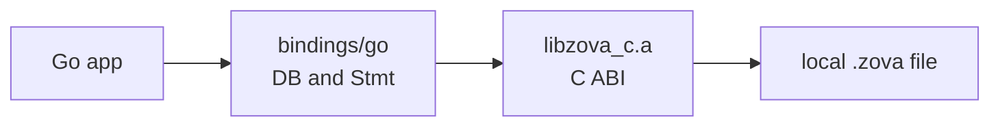

# Zova Go Bindings

This module contains the source-first Go bindings for Zova.

It covers:

- database create/open/close
- SQLite-to-Zova conversion
- SQL `exec`
- prepared statements with bind/step/column access
- explicit transactions
- explicit named savepoints
- explicit `VACUUM`
- backup, compact copy, and restore-to-new-file
- objects, chunks, manifests, range reads, assembly, and `ObjectWriter`
- vector collections, vector CRUD, batch writes, collection management, exact
  search, candidate search, search-by-id, thresholds, and SQL-native vector
  search

## Contents

1. [How It Fits](#how-it-fits)
2. [Build Requirements](#build-requirements)
3. [Handle Policy](#handle-policy)
4. [Savepoints](#savepoints)
5. [Operational Safety](#operational-safety)
6. [Objects](#objects)
7. [Vectors](#vectors)
8. [Example](#example)

## How It Fits

The Go package uses cgo over Zova's C ABI. Your Go code talks to `DB` and
`Stmt`; the package handles C ownership and copies outputs into Go values.



## Build Requirements

The Go binding uses cgo over `include/zova.h` and links the local static C ABI
library.

From the repository root, build the C ABI first:

```sh
zig build c-abi
```

Then run Go tests:

```sh
cd bindings/go
go test ./...
```

The default cgo flags expect:

- headers in `../../include`
- `libzova_c.a` in `../../zig-out/lib`

For custom local builds, pass normal cgo flags:

```sh
CGO_CFLAGS="-I/path/to/include" \
CGO_LDFLAGS="-L/path/to/lib -lzova_c" \
go test ./...
```

For local test runs, `test.sh` accepts `ZOVA_INCLUDE_DIR` and `ZOVA_LIB_DIR`
and translates them into cgo flags:

```sh
ZOVA_INCLUDE_DIR=/path/to/include ZOVA_LIB_DIR=/path/to/lib sh test.sh
```

You need Zig `0.16.0` or newer, cgo enabled, and a working C compiler.

## Handle Policy

The Zova C ABI serializes calls on one database handle, so one native handle is
safe but not parallel. The Go wrapper keeps its own `DB` mutex as a simple
Go-level guard around the same contract. Open multiple `DB` handles to the same
file for parallel work; SQLite locking rules still apply across handles.

Object writers also use their parent `DB` lock. Zova writer operations reject
active user transactions, so finish or cancel writers outside explicit
application transactions.

Use `OpenWithOptions` with `OpenOptions{ReadOnly: true}` for read-only handles,
and `SetBusyTimeout` when an application wants SQLite to wait briefly on
cross-handle contention. No nonzero timeout is installed by default.

Use `LastInsertRowID`, `Changes`, `TotalChanges`, and `Stmt.ColumnName` for
normal application SQL record helpers. They do not expose or stabilize Zova's
private `_zova_*` tables.

## Savepoints

Use explicit savepoints for partial rollback inside one database connection:

```go
if err := db.BeginImmediate(); err != nil {
    log.Fatal(err)
}
if err := db.Savepoint("attach_file"); err != nil {
    log.Fatal(err)
}
if err := db.Exec("insert into attachments(filename) values ('draft.txt')"); err != nil {
    log.Fatal(err)
}
if err := db.RollbackToSavepoint("attach_file"); err != nil {
    log.Fatal(err)
}
if err := db.ReleaseSavepoint("attach_file"); err != nil {
    log.Fatal(err)
}
if err := db.Commit(); err != nil {
    log.Fatal(err)
}
```

Savepoint names are strict ASCII identifiers: 1-64 bytes, first byte
`[A-Za-z_]`, remaining bytes `[A-Za-z0-9_]`, and no case-insensitive `_zova_`
prefix. `RollbackToSavepoint` keeps the savepoint active; `ReleaseSavepoint`
removes it.
An inner released savepoint can still be undone by rolling back an outer
transaction or savepoint.

Use `WithSavepoint` when you want rollback cleanup tied to a callback:

```go
if err := db.WithSavepoint("attach_file", func(db *zova.DB) error {
    return db.Exec("insert into attachments(filename) values ('draft.txt')")
}); err != nil {
    log.Fatal(err)
}
```

`WithSavepoint` is cleanup ergonomics, not a multi-call concurrency lock. The
Go wrapper still serializes individual calls with its internal mutex.

## Operational Safety

Use `BackupTo` for a faithful snapshot, `CompactTo` for a space-reclaiming
copy, and `RestoreBackup` to copy a backup into a new destination file.
Destinations must be `.zova` paths and are never overwritten.

```go
if err := db.BackupTo("app.backup.zova"); err != nil {
    log.Fatal(err)
}
if err := db.CompactTo("app.compact.zova"); err != nil {
    log.Fatal(err)
}
if err := zova.RestoreBackup("app.backup.zova", "app.restored.zova"); err != nil {
    log.Fatal(err)
}
```

The zero-value options verify destinations after copying. Use
`BackupOptions{NoVerify: true}`, `CompactOptions{NoVerify: true}`, or
`RestoreOptions{NoVerify: true}` only when you will verify separately.

Diagnostic recovery commands such as `zova doctor`, `zova salvage --dry-run`,
and `zova salvage <source> <destination>` are CLI-first in the v0.16 line. The
Go package does not expose typed doctor/salvage report APIs yet, and library
code should not parse the human text output as a stable binding contract.

## Objects

Objects are content-addressed byte values stored by Zova while application
metadata stays in your SQL tables.

```go
db.Exec("create table attachments(id integer primary key, object_id blob not null)")

writer, err := db.ObjectWriter()
if err != nil {
    log.Fatal(err)
}
writer.Write([]byte("hello "))
writer.Write([]byte("from Go"))
objectID, err := writer.Finish()
if err != nil {
    log.Fatal(err)
}

insert, _ := db.Prepare("insert into attachments(object_id) values (?1)")
defer insert.Close()
insert.BindBlob(1, objectID[:])
insert.Step()
```

Use `PutObject` for in-memory bytes, `ObjectWriter` for streamed writes,
`ReadObjectRange` for previews, and `ObjectManifest` / `GetObjectChunk` /
`PutObjectChunk` / `AssembleObjectFromChunks` for receive-side chunk flows.

## Vectors

Vectors are native Zova rows grouped into named collections. Application
metadata stays in SQL tables, usually with a `vector_id text` column that points
at a vector row.

```go
db.Exec("create table chunks(id integer primary key, vector_id text not null, text text not null)")

err := db.CreateVectorCollection("chunks", zova.VectorCollectionOptions{
    Dimensions: 2,
    Metric:     zova.VectorMetricL2,
})
if err != nil {
    log.Fatal(err)
}

err = db.PutVectors("chunks", []zova.VectorInput{
    {ID: "intro", Values: []float32{0, 0}},
    {ID: "api", Values: []float32{1, 0}},
})
if err != nil {
    log.Fatal(err)
}

results, err := db.SearchVectors("chunks", []float32{0.2, 0}, 5)
if err != nil {
    log.Fatal(err)
}
for _, result := range results {
    fmt.Println(result.ID, result.Distance)
}
```

Use `SearchVectorsIn` when SQL has already selected candidate vector ids from
metadata. Use `SearchVectorsByID*` when an existing stored vector is the query.
Threshold variants use inclusive `distance <= maxDistance`; distances are always
lower-is-better.

Zova also registers SQL-native exact vector search on `.zova` connections. Use
`EncodeVectorBlob` to bind little-endian `f32` query blobs through prepared
statements:

```go
stmt, err := db.Prepare(`
select c.vector_id, c.text, s.distance
from zova_vector_search as s
join chunks as c on c.vector_id = s.vector_id
where s.collection = ?1
  and s.query_vector = ?2
  and s.top_k = ?3
order by s.rank`)
if err != nil {
    log.Fatal(err)
}
stmt.BindText(1, "chunks")
stmt.BindBlob(2, zova.EncodeVectorBlob([]float32{0.2, 0}))
stmt.BindInt64(3, 5)
```

Scalar distance functions are available too:

```sql
select zova_vector_distance('chunks', vector_id, ?1) as distance
from chunks
where source = 'docs'
order by distance
limit 10
```

## Example

```go
package main

import (
    "fmt"
    "log"

    zova "github.com/atasesli/zova/bindings/go"
)

func main() {
    db, err := zova.Create("example.zova")
    if err != nil {
        log.Fatal(err)
    }
    defer db.Close()

    if err := db.Exec("create table notes(id integer primary key, body text not null)"); err != nil {
        log.Fatal(err)
    }

    insert, err := db.Prepare("insert into notes(body) values (?1)")
    if err != nil {
        log.Fatal(err)
    }
    defer insert.Close()

    if err := insert.BindText(1, "hello from Go"); err != nil {
        log.Fatal(err)
    }
    step, err := insert.Step()
    if err != nil {
        log.Fatal(err)
    }
    fmt.Println(step == zova.StepDone)
}
```
