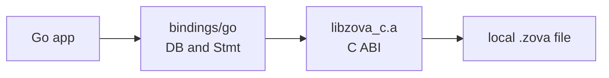

# Zova Go Bindings

This module contains the source-first Go bindings for Zova.

It covers:

- database create/open/close
- SQLite-to-Zova conversion
- SQL `exec`
- prepared statements with bind/step/column access
- explicit transactions
- explicit named savepoints
- explicit `VACUUM`
- backup, compact copy, and restore-to-new-file
- objects, chunks, manifests, range reads, assembly, and `ObjectWriter`
- vector collections, vector CRUD, batch writes, collection management, exact
  search, candidate search, search-by-id, thresholds, and SQL-native vector
  search
- graph lifecycle, node/edge CRUD, neighbors, and bounded walk traversal
- bundled extension lifecycle for process-registered extensions such as `trgm`
- same-process transaction-aware app events with `Listen` / `Notify`

## Contents

1. [How It Fits](#how-it-fits)
2. [Install](#install)
3. [Build Requirements](#build-requirements)
4. [Publishing](#publishing)
5. [Handle Policy](#handle-policy)
6. [Savepoints](#savepoints)
7. [Operational Safety](#operational-safety)
8. [Extensions](#extensions)
9. [App Events](#app-events)
10. [Objects](#objects)
11. [Vectors](#vectors)
12. [Bound Stores](#bound-stores)
13. [Graphs](#graphs)
14. [Example](#example)

## How It Fits

The Go package uses cgo over Zova's C ABI. Your Go code talks to `DB` and
`Stmt`; the package handles C ownership and copies outputs into Go values.


```mermaid
flowchart LR
    App["Go app"]
    GoPkg["bindings/go<br/>DB and Stmt"]
    CABI["libzova_c.a<br/>C ABI"]
    File["local .zova file"]

    App --> GoPkg
    GoPkg --> CABI
    CABI --> File
```

## Install

After the Go module tag is pushed, applications can add the binding with:

```sh
go get github.com/ata-sesli/zova/bindings/go@v1.0.0-rc.2
```

Import it as:

```go
import zova "github.com/ata-sesli/zova/bindings/go"
```

The Go package is source-only and uses cgo. It does not download or build the
native Zova C ABI automatically during `go get`; your build environment must
provide `zova.h` and `libzova_c.a`.

The current development build uses `.zova` format 11 and does not migrate older
format databases in place. Format-9 and format-10 databases can be probed and
migrated forward with the package-level `ProbeFormat(path)` and
`MigrateDatabase(source, destination, options...)` functions: migration is
explicit, copy-forward, publishes a separately validated format-11 destination,
and never mutates the source.

Opaque-key graph, edge-payload, topology-scan, prepared-build, and generic
fresh-build session APIs are supported low-level C/raw `zova-sys` surfaces.
The Go package deliberately exposes the established graph CRUD and traversal
API instead of those specialized publication surfaces.

## Build Requirements

The Go binding uses cgo over `include/zova.h` and links the local static C ABI
library.

For application builds, the easiest path is to download the matching prebuilt
C ABI archive from the Zova GitHub Release, then point cgo at its `include` and
`lib` directories:

```sh
CGO_CFLAGS="-I/path/to/zova-c-abi/include" \
CGO_LDFLAGS="-L/path/to/zova-c-abi/lib -lzova_c" \
go test ./...
```

The prebuilt C ABI archives are built by Zova's release workflow from the Zig
source. The Go module stays small and does not bundle generated C.

From the repository root, build the C ABI first:

```sh
zig build c-abi
```

Then run Go tests:

```sh
cd bindings/go
go test ./...
```

The default cgo flags expect:

- headers in `../../include`
- `libzova_c.a` in `../../zig-out/lib`

That default works inside this repository. When using the Go module from another
project, point cgo at an installed or locally built Zova C ABI:

```sh
CGO_CFLAGS="-I/path/to/zova/include" \
CGO_LDFLAGS="-L/path/to/zova/zig-out/lib -lzova_c" \
go test ./...
```

If you build the C ABI into a separate prefix, copy the header next to it:

```sh
zig build c-abi -p /path/to/zova-prefix
mkdir -p /path/to/zova-prefix/include
cp include/zova.h /path/to/zova-prefix/include/

CGO_CFLAGS="-I/path/to/zova-prefix/include" \
CGO_LDFLAGS="-L/path/to/zova-prefix/lib -lzova_c" \
go test ./...
```

For custom local builds, pass normal cgo flags:

```sh
CGO_CFLAGS="-I/path/to/include" \
CGO_LDFLAGS="-L/path/to/lib -lzova_c" \
go test ./...
```

For local test runs, `test.sh` accepts `ZOVA_INCLUDE_DIR` and `ZOVA_LIB_DIR`
and translates them into cgo flags:

```sh
ZOVA_INCLUDE_DIR=/path/to/include ZOVA_LIB_DIR=/path/to/lib sh test.sh
```

You need Zig `0.16.0` or newer, cgo enabled, and a working C compiler.

## Publishing

Go modules are published by Git tags, not by uploading to a central registry.
Because this module lives in the `bindings/go` subdirectory, the release tag
must include that subdirectory prefix:

```sh
git tag -a bindings/go/v1.0.0-rc.2 -m "Zova Go bindings v1.0.0-rc.2"
git push origin bindings/go/v1.0.0-rc.2
```

After pushing the tag, ask the public Go module proxy to resolve it:

```sh
GOPROXY=proxy.golang.org go list -m github.com/ata-sesli/zova/bindings/go@v1.0.0-rc.2
```

The module path is:

```text
github.com/ata-sesli/zova/bindings/go
```

## Handle Policy

The Zova C ABI serializes calls on one database handle, so one native handle is
safe but not parallel. The Go wrapper keeps its own `DB` mutex as a simple
Go-level guard around the same contract. Open multiple `DB` handles to the same
file for parallel work; SQLite locking rules still apply across handles.

Object writers also use their parent `DB` lock. Zova writer operations reject
active user transactions, so finish or cancel writers outside explicit
application transactions.

Use `OpenWithOptions` with `OpenOptions{ReadOnly: true}` for read-only handles,
and `SetBusyTimeout` when an application wants SQLite to wait briefly on
cross-handle contention. No nonzero timeout is installed by default.

Use `LastInsertRowID`, `Changes`, `TotalChanges`, and `Stmt.ColumnName` for
normal application SQL record helpers. They do not expose or stabilize Zova's
private `_zova_*` tables.

## Savepoints

Use explicit savepoints for partial rollback inside one database connection:

```go
if err := db.BeginImmediate(); err != nil {
    log.Fatal(err)
}
if err := db.Savepoint("attach_file"); err != nil {
    log.Fatal(err)
}
if err := db.Exec("insert into attachments(filename) values ('draft.txt')"); err != nil {
    log.Fatal(err)
}
if err := db.RollbackToSavepoint("attach_file"); err != nil {
    log.Fatal(err)
}
if err := db.ReleaseSavepoint("attach_file"); err != nil {
    log.Fatal(err)
}
if err := db.Commit(); err != nil {
    log.Fatal(err)
}
```

Savepoint names are strict ASCII identifiers: 1-64 bytes, first byte
`[A-Za-z_]`, remaining bytes `[A-Za-z0-9_]`, and no case-insensitive `_zova_`
prefix. `RollbackToSavepoint` keeps the savepoint active; `ReleaseSavepoint`
removes it.
An inner released savepoint can still be undone by rolling back an outer
transaction or savepoint.

Use `WithSavepoint` when you want rollback cleanup tied to a callback:

```go
if err := db.WithSavepoint("attach_file", func(db *zova.DB) error {
    return db.Exec("insert into attachments(filename) values ('draft.txt')")
}); err != nil {
    log.Fatal(err)
}
```

`WithSavepoint` is cleanup ergonomics, not a multi-call concurrency lock. The
Go wrapper still serializes individual calls with its internal mutex.

## Operational Safety

Use `BackupTo` for a faithful snapshot, `CompactTo` for a space-reclaiming
copy, and `RestoreBackup` to copy a backup into a new destination file.
Destinations must be `.zova` paths and are never overwritten.

```go
if err := db.BackupTo("app.backup.zova"); err != nil {
    log.Fatal(err)
}
if err := db.CompactTo("app.compact.zova"); err != nil {
    log.Fatal(err)
}
if err := zova.RestoreBackup("app.backup.zova", "app.restored.zova"); err != nil {
    log.Fatal(err)
}
```

The zero-value options verify destinations after copying. Use
`BackupOptions{NoVerify: true}`, `CompactOptions{NoVerify: true}`, or
`RestoreOptions{NoVerify: true}` only when you will verify separately.

Diagnostic recovery commands such as `zova doctor`, `zova salvage --dry-run`,
and `zova salvage <source> <destination>` are CLI-first. In v0.25, CLI salvage
copies valid core data and uses extension salvage hooks for extension-owned
storage. The Go package does not expose typed doctor/salvage report APIs yet,
and library code should not parse the human text output as a stable binding
contract.

## Extensions

Go exposes lifecycle methods for extensions already present in the current
process registry. The default registry includes bundled extensions such as
`trgm`, so Go applications can install, list, check, and drop `trgm` directly.
The v0.25 C ABI has scalar SQL callback registration and trusted `.zovaext`
bundle loading, but this Go binding does not expose arbitrary Go callback
registration yet. Use bundled/process-provided extensions or a host-owned C/Zig
bridge when SQL functions must run on Zova-owned connections.

See [../../docs/extensions.md](../../docs/extensions.md) for the current host
contract and trust model. A fuller records/objects/vectors/graphs example lives
in `examples/extensions`.

```go
if err := db.InstallExtension("trgm"); err != nil {
    return err
}
info, err := db.ExtensionInfo("trgm")
if err != nil {
    return err
}
fmt.Println(info.StoragePrefix)
if err := db.CheckExtensions(); err != nil {
    return err
}

put, err := db.Prepare("select zova_trgm_put('messages', ?1, 'record', 'messages', ?2, ?3)")
if err != nil {
    return err
}
defer put.Close()
_ = put.BindText(1, "message:123")
_ = put.BindText(2, "123")
_ = put.BindText(3, "attachment upload failed")
_, _ = put.Step()

search, err := db.Prepare(`
    select document_id, score
    from zova_trgm_search
    where index_name = 'messages'
      and query = ?1
      and "limit" = 10
    order by rank`)
if err != nil {
    return err
}
defer search.Close()
_ = search.BindText(1, "attachement failed")
```

## App Events

Use `Listen` / `Notify` for same-process storage workflow notifications. They
are explicit, in-memory, local to one open `DB` handle, and delivered only after
the surrounding Zova transaction commits. Rollback discards pending
notifications.

```go
sub, err := db.Listen("message:123:attachments")
if err != nil {
    log.Fatal(err)
}
defer sub.Close()

if err := db.BeginImmediate(); err != nil {
    log.Fatal(err)
}
if err := db.Exec("insert into attachments(message_id, name) values (123, 'photo.jpg')"); err != nil {
    log.Fatal(err)
}
if err := db.Notify("message:123:attachments", "changed"); err != nil {
    log.Fatal(err)
}
if err := db.Commit(); err != nil {
    log.Fatal(err)
}

note, err := sub.TryReceive()
if err != nil {
    log.Fatal(err)
}
if note != nil {
    log.Println(note.Channel, note.Payload)
}
```

SQL `zova_notify(...)` follows the same transaction rules when the surrounding
transaction/savepoint was opened through Zova helpers; raw SQL transaction
scopes are rejected because Zova cannot track their notification lifetime.

Event delivery is queue-only in v0.18: no callbacks, no blocking receive, no
cross-process delivery, no replay after restart, and no automatic logging of SQL,
object, vector, or graph mutations. Each subscription queue holds 1024
notifications and drops the oldest entries on overflow; the next received
notification reports how many were dropped before it.

## Objects

Objects are content-addressed byte values stored by Zova while application
metadata stays in your SQL tables.

```go
db.Exec("create table attachments(id integer primary key, object_id blob not null)")

writer, err := db.ObjectWriter()
if err != nil {
    log.Fatal(err)
}
writer.Write([]byte("hello "))
writer.Write([]byte("from Go"))
objectID, err := writer.Finish()
if err != nil {
    log.Fatal(err)
}

insert, _ := db.Prepare("insert into attachments(object_id) values (?1)")
defer insert.Close()
insert.BindBlob(1, objectID[:])
insert.Step()
```

Use `PutObject` for in-memory bytes, `ObjectWriter` for streamed writes,
`ReadObjectRange` for previews, and `ObjectManifest` / `GetObjectChunk` /
`PutObjectChunk` / `AssembleObjectFromChunks` for receive-side chunk flows.

## Vectors

Vectors are native Zova rows grouped into named collections. Application
metadata stays in SQL tables, usually with a `vector_id text` column that points
at a vector row.

```go
db.Exec("create table chunks(id integer primary key, vector_id text not null, text text not null)")

err := db.CreateVectorCollection("chunks", zova.VectorCollectionOptions{
    Dimensions:  2,
    Metric:      zova.VectorMetricL2,
    ElementType: zova.VectorElementTypeF32,
})
if err != nil {
    log.Fatal(err)
}

err = db.PutVectors("chunks", []zova.VectorInput{
    {ID: "intro", Values: zova.VectorValues{ElementType: zova.VectorElementTypeF32, F32: []float32{0, 0}}},
    {ID: "api", Values: zova.VectorValues{ElementType: zova.VectorElementTypeF32, F32: []float32{1, 0}}},
})
if err != nil {
    log.Fatal(err)
}

results, err := db.SearchVectors("chunks", zova.VectorValues{ElementType: zova.VectorElementTypeF32, F32: []float32{0.2, 0}}, 5)
if err != nil {
    log.Fatal(err)
}
for _, result := range results {
    fmt.Println(result.ID, result.Distance)
}
```

Vectors are typed by default. Collections use `VectorCollectionOptions` and
`VectorValues`. `F16` values
are raw IEEE 754 binary16 bits carried as `uint16`; `I8` values are raw signed
bytes with no quantization metadata.

```go
err = db.CreateVectorCollection("scores_i8", zova.VectorCollectionOptions{
    Dimensions:  2,
    Metric:      zova.VectorMetricL2,
    ElementType: zova.VectorElementTypeI8,
})
if err != nil {
    log.Fatal(err)
}
err = db.PutVector("scores_i8", "near", zova.VectorValues{
    ElementType: zova.VectorElementTypeI8,
    I8:          []int8{1, -1},
})

err = db.CreateVectorCollection("halves", zova.VectorCollectionOptions{
    Dimensions:  2,
    Metric:      zova.VectorMetricL2,
    ElementType: zova.VectorElementTypeF16,
})
if err != nil {
    log.Fatal(err)
}
err = db.PutVector("halves", "one", zova.VectorValues{
    ElementType: zova.VectorElementTypeF16,
    F16:         []uint16{0x3c00, 0x0000},
})
```

Use `SearchVectorsIn` when SQL has already selected candidate vector ids from
metadata. Use `SearchVectorsByID*` when an existing stored vector is the query.
Threshold variants use inclusive `distance <= maxDistance`; distances are always
lower-is-better.

## Bound Stores

In v0.25, a `.zova` file may be bound to one object store, one vector store,
and one graph store through the native Zig API or CLI. The Go object, vector,
and graph methods above transparently use those stores after `Open`. Store
create/bind/unbind/split
management is not exposed as a Go API yet.

Zova also registers SQL-native exact vector search on `.zova` connections. Use
`EncodeVectorBlob` to bind little-endian `f32` query blobs through prepared
statements:

```go
stmt, err := db.Prepare(`
select c.vector_id, c.text, s.distance
from zova_vector_search as s
join chunks as c on c.vector_id = s.vector_id
where s.collection = ?1
  and s.query_vector = ?2
  and s.top_k = ?3
order by s.rank`)
if err != nil {
    log.Fatal(err)
}
stmt.BindText(1, "chunks")
stmt.BindBlob(2, zova.EncodeVectorBlob([]float32{0.2, 0}))
stmt.BindInt64(3, 5)
```

Scalar distance functions are available too:

```sql
select zova_vector_distance('chunks', vector_id, ?1) as distance
from chunks
where source = 'docs'
order by distance
limit 10
```

## Graphs

Graphs store relationship topology while application metadata stays in SQL
tables, objects, and vectors. Apps provide stable node IDs and can point nodes
at records, objects, object chunks, vectors, entities, facts, concepts, or
external references.

```go
name := zova.DefaultGraphName
targetTable := "messages"
targetID := "1"
entityRef := "zova"
db.CreateGraph(name)

db.PutGraphNode(zova.GraphNodeInput{
    GraphName:       name,
    NodeID:          "message:1",
    Kind:            "message",
    TargetType:      zova.GraphTargetRecord,
    TargetNamespace: &targetTable,
    TargetRef:       &targetID,
})
db.PutGraphNode(zova.GraphNodeInput{
    GraphName:  name,
    NodeID:     "entity:zova",
    Kind:       "entity",
    TargetType: zova.GraphTargetEntity,
    TargetRef:  &entityRef,
})
db.PutGraphEdge(zova.GraphEdgeInput{
    GraphName:  name,
    FromNodeID: "message:1",
    EdgeType:   "mentions",
    ToNodeID:   "entity:zova",
})
```

Use `GraphNeighbors` for one-hop expansion and `GraphWalk` for bounded directed
walks. Zova validates object, chunk, and vector targets it owns, but arbitrary
SQL row existence remains the application's job. Node IDs may contain sensitive
app identifiers, so choose export-safe IDs when files may leave the app.

SQL-native graph helpers are available through ordinary prepared statements:

```go
stmt, err := db.Prepare(`
select m.body
from zova_graph_neighbors as g
join messages as m on m.graph_node_id = g.node_id
where g.graph_name = 'default'
  and g.source_node_id = 'message:1'
  and g."limit" = 20
order by g.rank`)
```

Use `zova_graph_neighbors` for one-hop joins and `zova_graph_walk` for bounded
directed walks with `depth`, `predecessor_node_id`, and `edge_type` columns.

## Example

```go
package main

import (
    "fmt"
    "log"

    zova "github.com/ata-sesli/zova/bindings/go"
)

func main() {
    db, err := zova.Create("example.zova")
    if err != nil {
        log.Fatal(err)
    }
    defer db.Close()

    if err := db.Exec("create table notes(id integer primary key, body text not null)"); err != nil {
        log.Fatal(err)
    }

    insert, err := db.Prepare("insert into notes(body) values (?1)")
    if err != nil {
        log.Fatal(err)
    }
    defer insert.Close()

    if err := insert.BindText(1, "hello from Go"); err != nil {
        log.Fatal(err)
    }
    step, err := insert.Step()
    if err != nil {
        log.Fatal(err)
    }
    fmt.Println(step == zova.StepDone)
}
```
