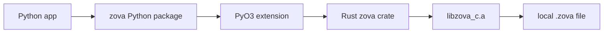

# Zova Python Bindings

This package contains the source-first Python bindings for Zova.

It is a PyO3/maturin extension backed by the safe Rust `zova` binding. It does
not wrap the C ABI directly with `ctypes` or cffi. The native build still uses
Zova's C ABI underneath through the Rust `zova-sys` crate, so Python gets the
same records/objects/vectors foundation without reimplementing the ABI ownership
rules.

## Contents

1. [How It Fits](#how-it-fits)
2. [Install](#install)
3. [Local Development](#local-development)
4. [What It Covers](#what-it-covers)
5. [Savepoints](#savepoints)
6. [Operational Safety](#operational-safety)
7. [App Events](#app-events)
8. [Objects](#objects)
9. [Vectors](#vectors)
10. [Graphs](#graphs)
11. [Bound Stores](#bound-stores)
12. [SQL-Native Vector Search](#sql-native-vector-search)

## How It Fits

Python users import `zova`. The extension is built with PyO3 and reuses the
safe Rust binding, which in turn links Zova's C ABI.



## Install

After the Python package is published to PyPI:

```sh
python -m pip install zova
```

The v0.20 Python package is source-first. It builds the PyO3 extension locally
through maturin and Cargo, and the Rust crates `zova` and `zova-sys` must be
available on crates.io first. Users need Python 3.10 or newer, Rust/Cargo, Zig
0.16.0 or newer, and a working C compiler/linker.

No official platform wheel matrix is promised in v0.20.

## Local Development

From `bindings/python`:

```sh
uv run --isolated --with maturin --with pytest maturin develop
uv run --isolated --with pytest python -m pytest
```

The native build uses maturin, Cargo, Zig, and the Rust `zova` crate. Users do
not need to locate a shared C library manually.

The Python API is pre-1.0 and may still change alongside the Rust binding.

## What It Covers

The Python package exposes database lifecycle, conversion, prepared SQL
statements, transactions, explicit vacuum, backup/compact/restore, objects,
streaming object writes, vectors, SQL-native vector search, graphs,
same-process app events, context managers, and Zova status exceptions.

One Python `Database` object owns one native handle. The native C ABI serializes
calls on that handle, so one handle is safe but not parallel. Open additional
database handles when an application needs independent concurrent connections;
SQLite locking rules still apply across handles. PyO3 classes remain unsendable
in this release even though the native C ABI serializes its own calls.

Use `Database.open(path, read_only=True)` for read-only handles, and
`Database.set_busy_timeout(milliseconds)` when an application wants SQLite to
wait briefly on cross-handle contention. No nonzero timeout is installed by
default.

Use `Database.last_insert_rowid()`, `Database.changes()`,
`Database.total_changes()`, and `Statement.column_name(index)` for normal
application SQL record helpers. They do not expose or stabilize Zova's private
`_zova_*` tables.

## Savepoints

Use explicit savepoints for partial rollback inside one database connection:

```python
with zova.Database.open("app.zova") as db:
    db.begin_immediate()
    db.savepoint("attach_file")
    db.exec("insert into attachments(filename) values ('draft.txt')")
    db.rollback_to_savepoint("attach_file")
    db.release_savepoint("attach_file")
    db.commit()
```

Savepoint names are strict ASCII identifiers: 1-64 bytes, first byte
`[A-Za-z_]`, remaining bytes `[A-Za-z0-9_]`, and no case-insensitive `_zova_`
prefix. `rollback_to_savepoint()` keeps the savepoint active;
`release_savepoint()` removes it.
An inner released savepoint can still be undone by rolling back an outer
transaction or savepoint.

Use `savepoint_context()` when you want rollback cleanup tied to a `with` block:

```python
with db.savepoint_context("attach_file") as scoped_db:
    scoped_db.exec("insert into attachments(filename) values ('draft.txt')")
```

On normal exit the context releases the savepoint. On exception it rolls back,
releases, and then re-raises the original exception when cleanup succeeds.

## Operational Safety

Use `backup_to()` for a faithful snapshot, `compact_to()` for a
space-reclaiming copy, and `restore_backup()` to copy a backup into a new
destination file. Destinations must be `.zova` paths and are never overwritten.

```python
with zova.Database.open("app.zova") as db:
    db.backup_to("app.backup.zova")
    db.compact_to("app.compact.zova")

zova.restore_backup("app.backup.zova", "app.restored.zova")
```

By default, each operation verifies the destination after copying. Pass
`verify=False` only when you will verify separately, for example with
`zova check --deep`.

Diagnostic recovery commands such as `zova doctor`, `zova salvage --dry-run`,
and `zova salvage <source> <destination>` are CLI-first. In v0.20, CLI salvage
copies valid graph topology and skips invalid graph nodes or edges. The Python
package does not expose typed doctor/salvage report APIs yet, and library code
should not parse the human text output as a stable binding contract.

## App Events

Use `listen` / `notify` for same-process storage workflow notifications. They
are explicit, in-memory, local to one open `Database` handle, and delivered only
after the surrounding Zova transaction commits. Rollback discards pending
notifications.

```python
with zova.Database.open("app.zova") as db:
    with db.listen("message:123:attachments") as sub:
        db.begin_immediate()
        db.exec("insert into attachments(message_id, name) values (123, 'photo.jpg')")
        db.notify("message:123:attachments", "changed")
        db.commit()

        note = sub.try_receive()
        if note is not None:
            print(note.channel, note.payload)
```

SQL `zova_notify(...)` follows the same transaction rules when the surrounding
transaction/savepoint was opened through Zova helpers; raw SQL transaction
scopes are rejected because Zova cannot track their notification lifetime.

Event delivery is queue-only in v0.18: no callbacks, no blocking receive, no
cross-process delivery, no replay after restart, and no automatic logging of SQL,
object, vector, or graph mutations. Each subscription queue holds 1024
notifications and drops the oldest entries on overflow; the next received
notification reports how many were dropped before it.

## Objects

The Python binding exposes Zova objects as content-addressed byte values while
keeping application metadata in normal SQL tables.

```python
import zova

with zova.Database.create("app.zova") as db:
    db.exec(
        "create table attachments("
        "id integer primary key, "
        "filename text not null, "
        "object_id blob not null)"
    )

    object_id = db.put_object(b"hello from Zova")

    with db.prepare("insert into attachments(filename, object_id) values (?1, ?2)") as stmt:
        stmt.bind_text(1, "hello.txt")
        stmt.bind_blob(2, bytes(object_id))
        stmt.step()

    assert db.read_object_range(object_id, 0, 5) == b"hello"
```

For large inputs, use `ObjectWriter` so the full object does not have to be held
in memory by the caller:

```python
with db.object_writer() as writer:
    writer.write(b"chunk one")
    writer.write(b"chunk two")
    object_id = writer.finish()
```

If a writer leaves the context without `finish()`, it is cancelled and any
unreferenced chunks written by that writer are cleaned up. Writer operations
follow Zova's object transaction policy in single-file mode. When an object
store is bound, object writes participate in the same Zova transaction/savepoint
scope through SQLite `ATTACH`.

Loose chunks and assembly are also exposed for receive-side workflows:
applications track transfer state in their own SQL tables, call
`put_object_chunk()` for verified chunks, then call
`assemble_object_from_chunks()` when the manifest is complete.

## Vectors

The Python binding exposes Zova vectors with the same model as the Rust binding:
Zova stores numeric vectors in named collections, while application metadata
stays in normal SQL tables.

```python
import zova

with zova.Database.create("vectors.zova") as db:
    db.exec(
        "create table chunks("
        "id text primary key, "
        "document_id text not null, "
        "text text not null, "
        "vector_id text not null)"
    )

    db.create_vector_collection(
        "chunks",
        zova.VectorCollectionOptions(2, zova.VectorMetric.L2),
    )
    db.put_vectors(
        "chunks",
        [
            zova.VectorInput("chunk:1", [0.0, 0.0]),
            zova.VectorInput("chunk:2", [1.0, 0.0]),
        ],
    )

    db.exec(
        "insert into chunks(id, document_id, text, vector_id) values "
        "('c1', 'doc-a', 'first chunk', 'chunk:1'), "
        "('c2', 'doc-a', 'near chunk', 'chunk:2')"
    )

    results = db.search_vectors_in(
        "chunks",
        [0.0, 0.0],
        ["chunk:1", "chunk:2"],
        2,
    )
    for result in results:
        with db.prepare("select text from chunks where vector_id = ?1") as stmt:
            stmt.bind_text(1, result.id)
            stmt.step()
            print(result.id, result.distance, stmt.column_text(0))
```

Search is exact and lower distance is better. Candidate-filtered searches skip
missing ids and deduplicate duplicate candidates. Search-by-id excludes the
source vector. Threshold variants are inclusive, and dot-product thresholds may
be negative because dot distance is `-dot_product`.

Deleting a vector collection removes Zova's private vector rows only. User SQL
metadata rows that reference vector ids are application-owned and remain in
place.

## Graphs

Graphs store relationship topology while application metadata stays in SQL
tables, objects, and vectors. Apps provide stable node IDs and can point nodes
at records, objects, object chunks, vectors, entities, facts, concepts, or
external references.

```python
db.create_graph(zova.DEFAULT_GRAPH_NAME)
db.put_graph_node(
    zova.GraphNodeInput(
        zova.DEFAULT_GRAPH_NAME,
        "message:1",
        "message",
        zova.GraphTargetType.RECORD,
        "messages",
        "1",
    )
)
db.put_graph_node(
    zova.GraphNodeInput(
        zova.DEFAULT_GRAPH_NAME,
        "entity:zova",
        "entity",
        zova.GraphTargetType.ENTITY,
        None,
        "zova",
    )
)
db.put_graph_edge(
    zova.GraphEdgeInput(
        zova.DEFAULT_GRAPH_NAME,
        "message:1",
        "mentions",
        "entity:zova",
    )
)
```

Use `graph_neighbors()` for one-hop expansion and `graph_walk()` for bounded
directed walks. Zova validates object, chunk, and vector targets it owns, but
arbitrary SQL row existence remains the application's job. Node IDs may contain
sensitive app identifiers, so choose export-safe IDs when files may leave the
app.

SQL-native graph helpers are available through ordinary prepared statements:

```python
with db.prepare(
    "select m.body "
    "from zova_graph_neighbors as g "
    "join messages as m on m.graph_node_id = g.node_id "
    "where g.graph_name = 'default' "
    "and g.source_node_id = 'message:1' "
    'and g."limit" = 20 '
    "order by g.rank"
) as stmt:
    ...
```

Use `zova_graph_neighbors` for one-hop joins and `zova_graph_walk` for bounded
directed walks with `depth`, `predecessor_node_id`, and `edge_type` columns.

## Bound Stores

In v0.20, a `.zova` file may be bound to one object store and one vector store
through the native Zig API or CLI. The Python object and vector methods above
transparently use those stores after `Database.open`. Store
create/bind/unbind/split management is not exposed as a Python API yet.

## SQL-Native Vector Search

Zova registers SQL vector functions and the `zova_vector_search` virtual table
on Zova database connections. Bind query vectors as little-endian `f32` blobs
with `encode_f32_le()`:

```python
query = zova.encode_f32_le([0.0, 0.0])

with db.prepare(
    "select c.id, zova_vector_distance('chunks', c.vector_id, ?1) as distance "
    "from chunks as c "
    "where c.document_id = 'doc-a' "
    "order by distance "
    "limit 10"
) as stmt:
    stmt.bind_blob(1, query)
```

Row-to-row distances use `zova_vector_distance_by_id(collection, vector_id,
source_vector_id)`. Collection-wide SQL search uses `zova_vector_search`:

```python
with db.prepare(
    "select c.text, s.distance "
    "from zova_vector_search as s "
    "join chunks as c on c.vector_id = s.vector_id "
    "where s.collection = 'chunks' "
    "and s.query_vector = ?1 "
    "and s.top_k = 10 "
    "order by s.rank"
) as stmt:
    stmt.bind_blob(1, query)
```

Python's built-in `sqlite3` module opens an ordinary SQLite connection and does
not automatically register Zova's SQL functions or virtual table. Use
`zova.Database` for SQL-native vector search in this binding. A future SQLite
loadable extension may make the SQL surface available to external SQLite
connections.
