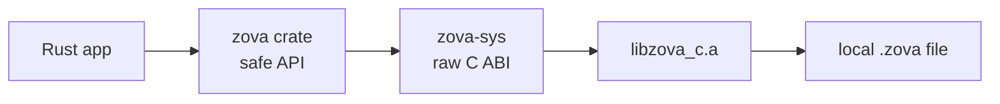

# Zova Rust Bindings

This workspace contains the source-first Rust bindings for Zova.

It contains:

- `zova-sys`: raw C ABI declarations and static linking.
- `zova`: safe Rust wrappers for database lifecycle, SQL prepared statements,
  transactions, explicit vacuum, objects, chunks, manifests, range reads,
  assembly, `ObjectWriter`, vector collections, vector CRUD, and exact vector
  search, plus backup, compact copy, and restore-to-new-file.

## Contents

1. [How It Fits](#how-it-fits)
2. [Install From crates.io](#install-from-cratesio)
3. [Local Build](#local-build)
4. [Handle Policy](#handle-policy)
5. [Example](#example)
6. [Savepoints](#savepoints)
7. [Operational Safety](#operational-safety)

## How It Fits

Rust users normally use the safe `zova` crate. The lower-level `zova-sys` crate
is there for ABI coverage and for users who explicitly want raw C calls.



## Install From crates.io

Use the safe crate for normal Rust applications:

```toml
[dependencies]
zova = "0.17.0"
```

Use the raw FFI crate only when you want to call the C ABI directly:

```toml
[dependencies]
zova-sys = "0.17.0"
```

Both crates contain native code. The default build path compiles Zova's static C
ABI library through `zova-sys`, so registry users still need:

- Rust,
- Zig `0.16.0` or newer,
- a C compiler/linker for their platform.

Zova is still pre-1.0. The Rust API, C ABI, and `.zova` format are usable, but
they may evolve before the 1.0 line. The current `.zova` `format_version` is
`3`.

## Local Build

Inside this repository, `zova-sys` builds the local C ABI with:

```sh
zig build c-abi
```

Cargo then links the resulting static library. You can point Cargo at an
existing build instead:

```sh
ZOVA_LIB_DIR=/path/to/lib ZOVA_INCLUDE_DIR=/path/to/include cargo test
```

`ZOVA_INCLUDE_DIR` is accepted for callers that vendor the header alongside the
library. The current hand-written FFI does not run bindgen.

You can also point the native build at a separate Zova source checkout:

```sh
ZOVA_SOURCE_DIR=/path/to/zova/source cargo test
```

When building from crates.io without overrides, `zova-sys` uses its bundled
native source snapshot.

Zova currently requires Zig `0.16.0` or newer for the local C ABI build.

## Handle Policy

The C ABI serializes calls on one `zova_database` handle, so the native handle
can be called from multiple threads safely, one call at a time. Rust exposes two
safe surfaces on top of that:

- `Database` is the single-owner API. It is deliberately not `Send` or `Sync`,
  and its methods use mutable borrows.
- `SharedDatabase` is the opt-in shared API. It is `Clone + Send + Sync`,
  serializes calls with a Rust mutex, and copies C ABI diagnostics before
  another Rust thread can replace them.

Use one `SharedDatabase` when you want a simple shared storage handle, such as
from Tauri commands or worker threads. It is safe, but not parallel: one call on
that handle runs at a time. Open multiple `Database` or `SharedDatabase` handles
to the same file for true concurrent SQLite work and let SQLite locking decide
cross-handle concurrency.

For multi-call units that must not interleave with other calls on the same
shared handle, use `SharedDatabase::with_exclusive`,
`SharedDatabase::transaction`, or `SharedDatabase::transaction_immediate`.

Use `Database::open_with_options` with `OpenOptions { read_only: true, .. }`
or `SharedDatabase::open_with_options` for read-only handles, and
`set_busy_timeout` when an application wants SQLite to wait briefly on
cross-handle contention. No nonzero timeout is installed by default.

## Example

Records use prepared SQL statements:

```rust
use zova::{Database, Step};

let mut db = Database::create("example.zova")?;
db.exec("create table notes(id integer primary key, body text not null)")?;

let mut insert = db.prepare("insert into notes(body) values (?1)")?;
insert.bind_text(1, "hello from Rust")?;
assert_eq!(insert.step()?, Step::Done);
assert_eq!(db.changes()?, 1);
let rowid = db.last_insert_rowid()?;
```

Use `Database::changes`, `Database::total_changes`,
`Database::last_insert_rowid`, and `Statement::column_name` for normal
application SQL record helpers. They are not a public interface to Zova's
private `_zova_*` tables.

## Savepoints

Use explicit savepoints for partial rollback inside one connection:

```rust
let mut db = Database::open("app.zova")?;
db.begin_immediate()?;
db.savepoint("attach_file")?;
db.exec("insert into attachments(filename) values ('draft.txt')")?;
db.rollback_to_savepoint("attach_file")?;
db.release_savepoint("attach_file")?;
db.commit()?;
```

`SharedDatabase` exposes the same methods. Inside
`SharedDatabase::transaction` or `transaction_immediate`, the guard also has
`savepoint`, `rollback_to_savepoint`, and `release_savepoint`, so nested
checkpoints do not interleave with other threads on the shared handle.

Savepoint names are strict ASCII identifiers: 1-64 bytes, first byte
`[A-Za-z_]`, remaining bytes `[A-Za-z0-9_]`, and no case-insensitive `_zova_`
prefix. `ROLLBACK TO` keeps the savepoint active; `RELEASE` removes it.
An inner released savepoint can still be undone by rolling back an outer
transaction or savepoint.

Use `with_savepoint` when you want rollback cleanup tied to a closure:

```rust
db.with_savepoint("attach_file", |db| {
    db.exec("insert into attachments(filename) values ('draft.txt')")?;
    Ok(())
})?;
```

`SharedDatabase::with_savepoint` and `SharedDatabaseGuard::with_savepoint`
hold the shared Rust mutex for the whole closure, so the scoped unit does not
interleave with other threads using the same shared handle.

## Operational Safety

Use `backup_to` for a faithful snapshot, `compact_to` for a space-reclaiming
copy, and `restore_backup` to copy a backup into a new destination file.
Destinations must be `.zova` paths and are never overwritten.

```rust
use zova::{restore_backup, BackupOptions, CompactOptions, Database, RestoreOptions};

let mut db = Database::open("app.zova")?;
db.backup_to("app.backup.zova", BackupOptions::default())?;
db.compact_to("app.compact.zova", CompactOptions::default())?;
restore_backup(
    "app.backup.zova",
    "app.restored.zova",
    RestoreOptions::default(),
)?;
```

`SharedDatabase` exposes the same `backup_to` and `compact_to` methods. By
default, each operation verifies the destination after copying. Pass
`BackupOptions { verify: false }`, `CompactOptions { verify: false }`, or
`RestoreOptions { verify: false }` only when you will verify separately.

Diagnostic recovery commands such as `zova doctor`, `zova salvage --dry-run`,
and `zova salvage <source> <destination>` are CLI-first in the v0.16 line. The
Rust crates do not expose typed doctor/salvage report APIs yet, and library code
should not parse the human text output as a stable binding contract.

Objects can live beside ordinary SQL metadata:

```rust
use std::convert::TryFrom;
use zova::{Database, ObjectId, Step};

let mut db = Database::create("files.zova")?;
db.exec("create table attachments(id integer primary key, object_id blob not null)")?;

let id = db.put_object(b"file bytes")?;

let mut insert = db.prepare("insert into attachments(object_id) values (?1)")?;
insert.bind_blob(1, id.as_ref())?;
assert_eq!(insert.step()?, Step::Done);
drop(insert);

let mut query = db.prepare("select object_id from attachments where id = 1")?;
assert_eq!(query.step()?, Step::Row);
let stored_id = ObjectId::try_from(query.column_blob(0)?.unwrap().as_slice())?;
drop(query);

assert_eq!(db.get_object(stored_id)?, b"file bytes");
```

For large writes, use `Database::object_writer()` to stream data into Zova
without keeping the complete object in memory. Transfer state, filenames, MIME
types, and application references still belong in user SQL tables.
Writer operations serialize through their parent database handle at the C ABI
boundary and return a Zova transaction error when used inside an active user
transaction.

Vectors follow Zova's SQL-metadata model: store labels, document ids, and other
metadata in ordinary tables, and store numeric vectors in a named collection.

```rust
use zova::{Database, VectorCollectionOptions, VectorInput, VectorMetric};

let mut db = Database::create("vectors.zova")?;
db.exec("create table chunks(id text primary key, vector_id text not null, body text)")?;

db.create_vector_collection(
    "chunks",
    VectorCollectionOptions {
        dimensions: 2,
        metric: VectorMetric::L2,
    },
)?;
db.put_vectors(
    "chunks",
    &[
        VectorInput { id: "v1", values: &[0.0, 0.0] },
        VectorInput { id: "v2", values: &[1.0, 0.0] },
    ],
)?;

let nearest = db.search_vectors("chunks", &[0.0, 0.0], 2)?;
assert_eq!(nearest[0].id, "v1");
```

SQL-native vector search is available through prepared statements too. Bind
query vectors as little-endian `f32` blobs when calling `zova_vector_distance`
or querying `zova_vector_search`; see `zova/examples/vectors.rs` for a complete
metadata join example.
